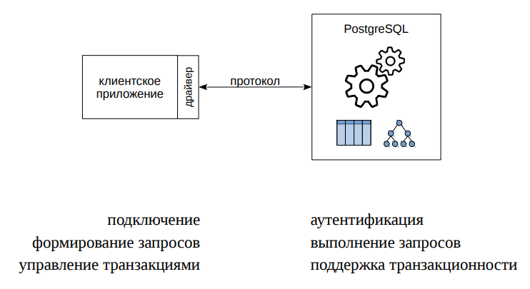
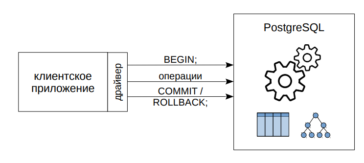
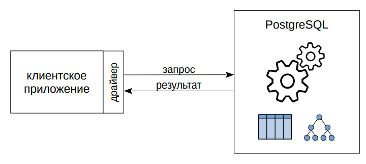
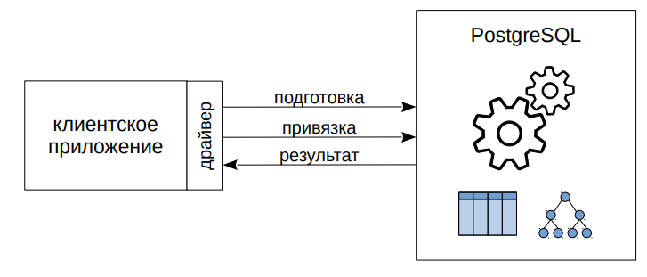
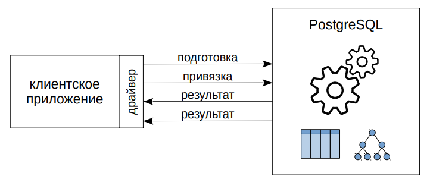
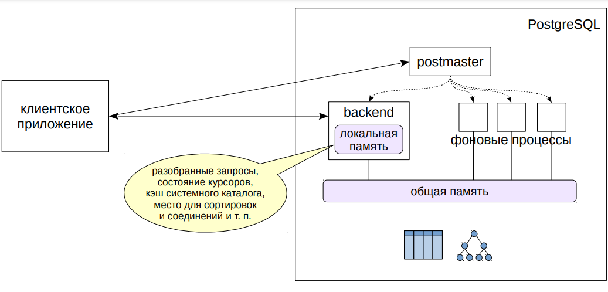
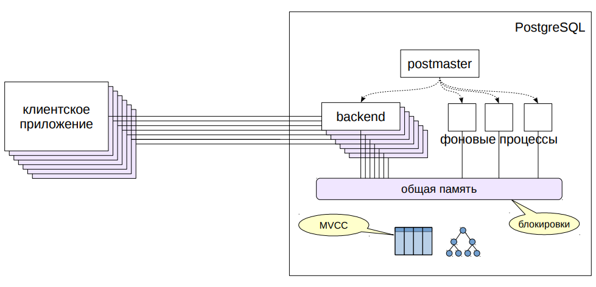
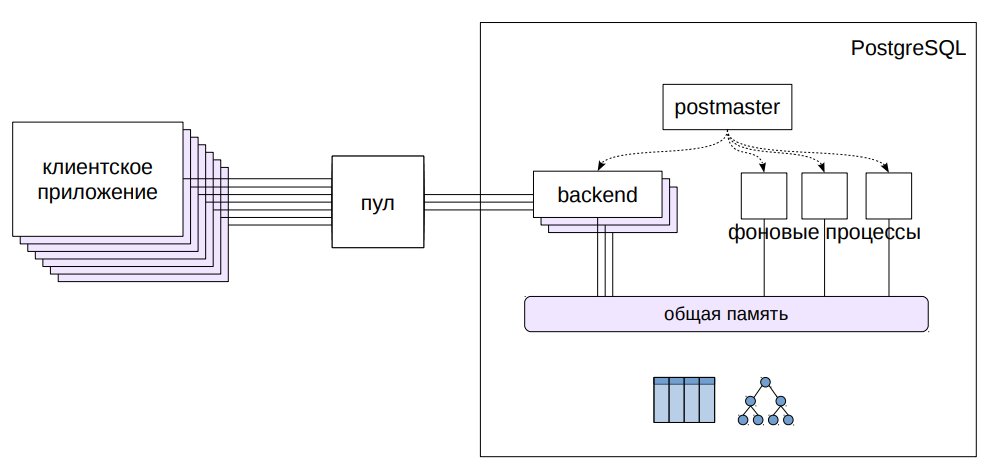
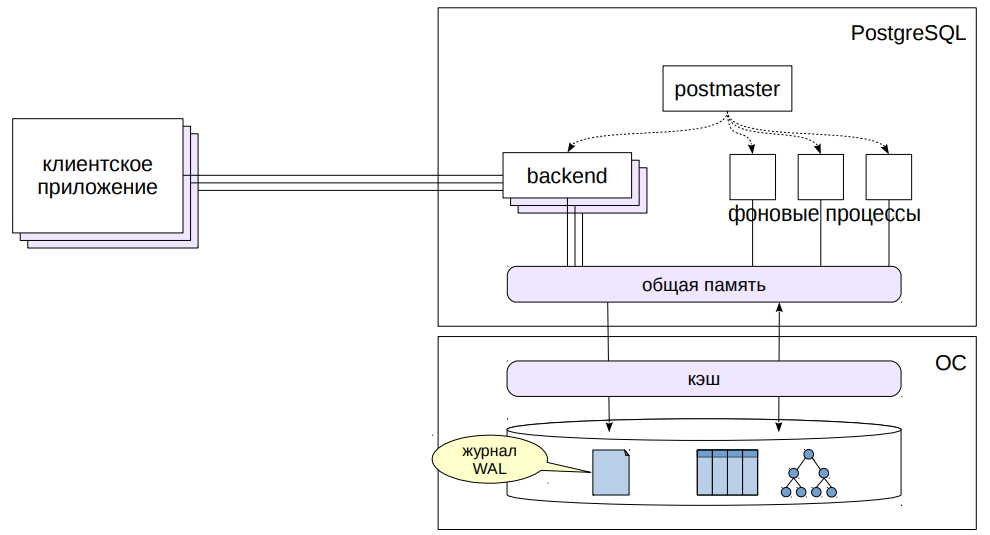
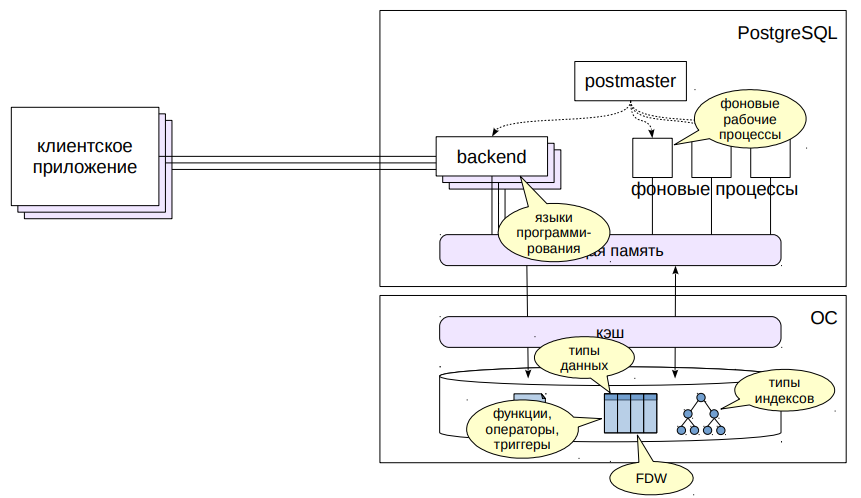

# Общее устройство PostgreSQL

##  Клиент и сервер

Начнем с простой картинки, на которой сервер представлен «черным
ящиком». Клиентское приложение — например, `psql`, или любая другая
программа, написанная на любом языке программирования (ЯП) —
подключается к серверу и как-то «общается» с ним. Чтобы клиент и
сервер понимали друг друга, они должны использовать один и тот же
протокол взаимодействия. Протокол довольно низкоуровневый и
реализовывать его в каждом клиенте, конечно, не нужно. Обычно
клиентская программа используется драйвер, предоставляющий набор
функций для использования в программе. Драйвер может пользоваться
готовой реализацией протокола (библиотекой `libpq`), либо может
реализовать протокол самостоятельно.
Поэтому на самом деле не так важно, на каком ЯП написан клиент — за
разным синтаксисом будут те же самые возможности, определяемые
протоколом.
Если говорить в самых общих чертах, то протокол позволяет клиенту
подключиться; при этом сервер выполняет так называемую
аутентификацию — например, запрашивает пароль и решает, можно ли
разрешить подключение. Далее клиент посылает серверу запросы на
языке SQL, а сервер выполняет их и возвращает результат.
Наличие языка запросов — одна из особенностей, которые отличают
СУБД от, например, работы с файлами данных. Другая важнейшая
особенность — поддержка согласованной работы транзакций.

## Транзакции

* **атомарность** — все или ничего
* **согласованность** — ограничения целостности и пользовательские ограничения
* **изоляция** — влияние параллельных процессов
* **долговечность** — сохранность данных даже после сбоя

Под транзакцией понимается некоторая логически неделимая часть
работы, сохраняющая согласованность данных в базе.
От транзакций ожидают выполнения четырех свойств **(ACID)**:
- **Атомарность**: транзакция либо выполняется полностью, либо не
  выполняется вовсе. Для этого начало транзакции отмечается командой
  `BEGIN`, а конец — либо `COMMIT` (фиксация изменений), либо
  `ROLLBACK` (отмена изменений).

- **Согласованность**: транзакция начинается в согласованном состоянии
  и, завершаясь, также сохраняет согласованность.

- **Изоляция**: другие транзакции, выполняющиеся одновременно с
  данной, не должны оказывать на нее влияние.

- **Долговечность**: после того, как данные зафиксированы, они не
  должны потеряться даже в случае сбоя.
  За управление транзакциями (команды начала и окончания транзакции)
  в PostgreSQL отвечает клиентское приложение

## Выполнение запроса

- **разбор** ← системный каталог
- **трансформация** ← правила
- **планирование** ← статистика
- **выполнение** ← данные

Выполнение запроса — довольно сложная задача.

Запрос передается от клиента серверу в виду текста. Текст надо
разобрать — выполнить синтаксический разбор (складываются ли
буквы в слова, а слова в команды) и семантический разбор (есть ли в
базе данных таблицы и другие объекты, на которые запрос ссылается
по имени). Для этого требуется информация о том, что вообще
содержится в базе данных. Такая мета-информация называется
системным каталогом и хранится в самой же базе данных в
специальных таблицах.

Запрос может трансформироваться — например, вместо имени
представления подставляется текст запроса. Можно придумать и свои
трансформации, для чего есть механизм правил.

Поскольку SQL — декларативный язык: запрос на нем говорит о том,
какие данные надо получить, но не говорит, как это сделать. Поэтому
запрос (уже разобранный и представленный в виде дерева),
передается планировщику, который разрабатывает план выполнения.
Например, планировщик решает, надо или не надо использовать
индексы. Чтобы качественно спланировать работу, планировщику
нужна информация о размере таблиц, о распределении данных —
статистика.

Далее запрос выполняется в соответствии с планом и результат
возвращается клиенту

## Подготовка операторов

- разбор
- трансформация
- привязка ← значения параметров
- планирование
- выполнение

Каждый запрос проходит перечисленные шаги. Но если один и тот же
запрос (с точностью до параметров) выполняется много раз, нет
смысла каждый раз заново разбирать его.

PostgreSQL позволяет подготовить запрос — заранее выполнить
разбор и трансформацию и запомнить дерево разбора.

При выполнении запроса выполняется привязка конкретных значений
параметров. Если необходимо, выполняется планирование (в
некоторых случаях PostgreSQL запоминает план запроса и не
выполняет повторно этот шаг). Затем запрос выполняется.

## Курсоры

- разбор
- трансформация
- привязка ← значения параметров
- планирование
- выполнение
- получение результата

Не всегда клиенту бывает удобно получить все результаты сразу.
Данных может оказаться много, но не все они могут быть нужны.

Для этого есть механизм курсоров — открыв курсор для запроса,
клиент может получать из него данные построчно по мере
необходимости.

Понятно, что серверу приходится хранить вспомогательную
информацию: разобранные запросы и их планы, состояние открытых
курсоров. Где и как он это делает? Для ответа на этот вопрос надо
заглянуть внутрь сервера и познакомиться с его устройством.

## Процессы и память

Изнутри сервер PostgreSQL можно представить как несколько
взаимодействующих процессов.

В первую очередь при старте сервера запускается процесс,
традиционно называемый `postmaster`. Он запускает все остальные
процессы (с помощью системного вызова `fork` в юниксе) и
«присматривает» за ними — если какой-нибудь процесс завершится
аварийно, `postmaster` перезапустит его (или перезапустит весь сервер,
если сочтет, что процесс мог повредить общие данные).

Работу сервера обеспечивает ряд фоновых служебных процессов.
Позже мы поговорим об основных из них.

Чтобы процессы могли обмениваться информацией, `postmaster`
выделяет общую память, доступ к которой могут получить все
процессы. Кроме общей памяти, каждый процесс имеет и свою
локальную память, доступную только ему самому.

Чтобы клиент мог подключиться к серверу, `postmaster` слушает
входящие соединения. При появлении клиента postmaster порождает
обслуживающий процесс (`backend`) и дальше каждый клиент общается
со своим процессом.

Место, необходимое для выполнения запроса (разобранные запросы и
их планы, состояние курсоров, кэш системного каталога, место для
сортировки данных и т. п.), выделяется в локальной памяти
обслуживающего процесса.

## Много клиентов

Когда к серверу подключается много клиентов, для каждого из них
порождается собственный обслуживающий процесс. Это не проблема,
если на всех хватает оперативной памяти и соединения не происходят
слишком часто.

Тем не менее при одновременной работе с какими-либо объектами
приходится принимать меры, чтобы один процесс не поменял какиелибо данные в то время, пока с ними работает другой процесс.
Для объектов в общей памяти используются короткоживущие
блокировки. PostgreSQL делает это достаточно аккуратно для того,
чтобы система хорошо масштабировалась при увеличении числа
процессоров (ядер).

С таблицами сложнее, поскольку блокировки придется удерживать до
конца транзакций (то есть потенциально в течение долгого времени).
из-за чего масштабируемость может пострадать. Поэтому PostgreSQL
использует механизм многоверсионности (MVCC, multiversion
concurrency control): одни и те же данные могут одновременно
существовать в разных версиях. Каждый процесс видит собственную
(но всегда согласованную) картину данных. Это позволяет блокировать
только те процессы, которые пытаются изменить данные, уже
измененные, но еще не зафиксированные, другими процессами.

Многоверсионность — тот основной механизм, который обеспечивает
первые три свойства транзакций (атомарность, согласованность,
изоляция). Про него мы будем говорить отдельно.

## Пул соединений

Если клиентов слишком много, или соединения устанавливаются и
разрываются слишком часто, стоит подумать о применении пула
соединений. Такую функцию обычно предоставляет сервер приложений
или можно воспользоваться сторонними менеджерами пула (наиболее
известен PgBouncer https://pgbouncer.github.io/).

Клиенты подключаются не к серверу БД, а к менеджеру пула. Менеджер
удерживает открытыми несколько соединений с сервером баз данных и
использует одно из свободных для того, чтобы выполнять запросы
клиента. Таким образом, с точки зрения сервера БД число клиентов
остается постоянным вне зависимости от того, сколько клиентов
обращаются к менеджеру пула.

Но при таком режиме работы несколько клиентов разделяют один и тот
же обслуживающий процесс, который — как мы говорили — в своей
локальной памяти хранит определенное состояние (в частности,
разобранные запросы для подготовленных операторов). Это
необходимо учитывать при разработке приложения.

## Хранение данных

PostgreSQL работает с дисками, на которых находятся данные, не
напрямую, а через операционную систему. Данные хранятся в обычных
файлах и читаются или записываются с помощью соответствующих
системных вызовов.

Из-за того, что диски работают значительно медленнее, чем
оперативная память (особенно HDD, но и SSD тоже), применяется
кэширование: в оперативной памяти отводится место под недавно
прочитанные страницы в надежде, что к ним будет несколько
обращений и можно будет сэкономить на повторном обращении к диску.
Измененные данные также записываются на диск не сразу, а через
некоторое время.

Важный момент: кэш имеется как у операционной системы, так и у
PostgreSQL. Кэш данных PostgreSQL (буферный кэш) располагается в
общей памяти, чтобы все процессы имели к нему доступ.

При сбое (например, питания) содержимое оперативной памяти
пропадает и часть данных может потеряться — что недопустимо
(свойство долговечности). Поэтому в процессе работы PostgreSQL
постоянно записывает журнал, позволяющий повторно выполнить
потерянные операции и восстановить данные в согласованном
состоянии. Про буферный кэш и журнал мы еще будем говорить
отдельно.

## Расширяемость

PostgreSQL спроектирован с расчетом на расширяемость.

Для прикладного программиста есть возможность создавать
собственные типы данных на основе уже имеющихся (составные
типы, диапазоны, массивы, перечисления), писать хранимые
функции для обработки данных (в том числе триггеры,
срабатывающие автоматически при наступлении каких-либо
событий).

Если владеть языком программирования Си, можно написать
расширение, которое добавляет необходимый функционал и
обычно может подключаться даже к работающему серверу.

Благодаря такой архитектуре, существует большое количество
расширений, которые:
- добавляют поддержку языков программирования (помимо
  стандартных `SQL`, `PL/pgSQL` `PL/Perl`, `PL/Python` и `PL/Tcl`);
- вводят новые типы данных и операторы для работы с ними;
- создают новые типы индексов для эффективной работы с
  разнообразными типами данных (помимо стандартных B-деревьев
  есть также хеш-индекс, `GiST`, `SP-GiST`, `GIN`, `BRIN`, `Bloom`);
- подключают внешние системы с помощью оберток сторонних
  данных (`foreign data wrapper`, `FDW`);
- запускают фоновые процессы для выполнения периодических
  заданий.

## Итоги

- Протокол позволяет клиентам подключаться к серверу,
выполнять запросы и управлять транзакциями
- Каждый клиент обслуживается своим процессом
- Данные хранятся в файлах, обращение происходит
через операционную систему
- Кэширование как в локальной памяти (каталог,
разобранные запросы), так и в общей (буферный кэш)