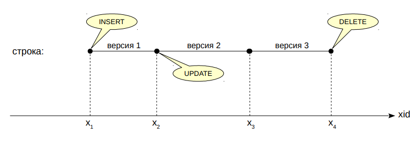
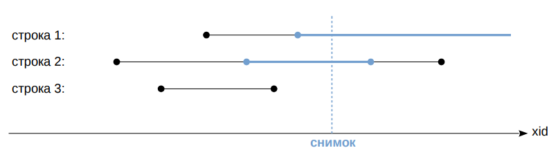
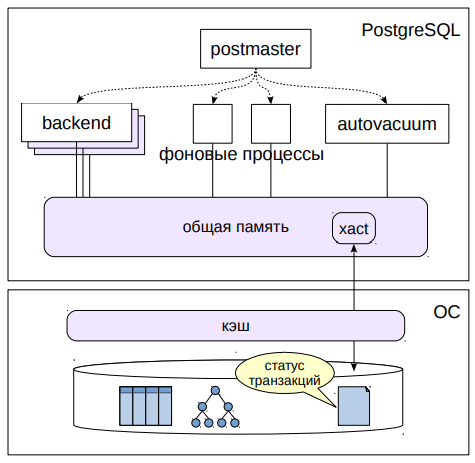

# Изоляция и многоверсионность

## Многоверсионность
* Наличие нескольких версий одной и той же строки
  * версии различаются временем действия
  * время = номер транзакции (номера выдаются по возрастанию)



При одновременной работе нескольких сеансов возникает задача: что
делать, если две транзакции одновременно обращаются к одной и той
же строке? Если обе транзакции читающие, сложностей нет. Если обе
пишущие — тоже (в этом случае они выстраиваются в очередь и
выполняют изменения друг за другом). Самый интересный вариант —
как взаимодействуют пишущая и читающая транзакции.

Простых пути два. Такие транзакции могут блокировать друг друга —
но тогда страдает производительность. Либо же читающая транзакция
сразу видит изменения, сделанные пишущей транзакцией, даже если
они не зафиксированы — но это очень плохо, ведь изменения могут
быть отменены (это называется «грязным чтением»).

PostgreSQL идет сложным путем и использует многоверсионность —
хранит несколько версий одной и той же строки. При этом пишущая
транзакция работает со своей версией, а читающая видит свою.

Чтобы отличать версии друг от друга, они помечаются двумя
отметками, определяющими «время» действия данной версии.
В качестве времени используются всегда возрастающие номера
транзакций (в действительности все немного сложнее, но это детали).
Когда строка создается, она помечается номером транзакции,
выполнившей команду `INSERT`. Когда удаляется — версия помечается
номером транзакции, выполнившей `DELETE` (но физически не
удаляется). UPDATE состоит из двух операций `DELETE` и `INSERT`.
https://postgrespro.ru/docs/postgresql/10/mvcc

## Снимок данных
* Согласованный срез на определенный момент времени
  * номер транзакции — определяет момент времени
  * список активных транзакций — чтобы не смотреть на еще не зафиксированные изменения



Но транзакция, работающая с таблицей, должна видеть только одну
версию каждой строки (или не видеть ни одной). Для этого транзакция
работает со снимком данных, созданным в определенный момент
времени. **Снимок — это не физическая копия данных, а всего
несколько чисел**:
- номер текущей транзакции на момент создания снимка (он
  определяет тот самый момент времени),
- и список активных транзакций на этот момент.

Список нужен для того, чтобы рассматривать изменения только тех
  транзакций, которые были зафиксированы до создания снимка. Нас не
  интересуют транзакции, которые начались до создания снимка, но еще
  не были зафиксированы, а также те, которые начались позже создания
  снимка.

Зная снимок, мы всегда можем сказать, какая из версий строки будет
  в нем видна. Иногда это будет актуальная (самая последняя) версия,
  как для строки 1 на иллюстрации. Иногда не самая последняя: строка 2
  удалена (и изменение уже зафиксировано), но транзакция еще
  продолжает видеть эту строку, пока работает со своим снимком. Это
  правильное поведение — оно дает согласованную картину данных на
  выбранный момент времени.

Какие-то строки вовсе не попадут в снимок: строка 3 удалена до того,
  как был построен снимок, поэтому в снимке ее нет.

## Блокировки

* Блокировки строк
  * чтение никогда не блокирует строк
  * изменение строки блокирует ее для изменений, но не для чтений
* Блокировки таблиц
  * запрещают изменение или удаление таблицы, пока с ней идет работа
  * запрещают чтение таблицы при перестроении или перемещении
  * и т. п.
* Время жизни блокировок
  * устанавливаются по мере необходимости или вручную
  * снимаются автоматически при завершении транзакции

Что же дает многоверсионность? Она позволяет обойтись только
самым необходимым минимумом блокировок, тем самым увеличивая
производительность системы.

Основные блокировки устанавливаются на уровне строк. При этом
чтение никогда не блокирует ни читающие, ни пишущие транзакции.
Изменение строки не блокирует ее чтение. Единственный случай, когда
транзакция будет ждать освобождения блокировки — если она
пытается менять строку, которая уже изменена другой, еще не
зафиксированной, транзакцией.

Блокировки также устанавливаются на более высоком уровне,
в частности на таблицах. Они нужны для того, чтобы никто не смог
удалить таблицу, пока другие транзакции читают из нее данные, или
чтобы запретить доступ к перестраиваемой таблице. Как правило,
такие блокировки не вызывают проблем, поскольку удаление или
перестроение таблиц — очень редкая операция.

Все необходимые блокировки устанавливаются автоматически и
автоматически же снимаются при завершении транзакции. Можно
также установить и дополнительные пользовательские блокировки;
необходимость в этом возникает не часто.
https://postgrespro.ru/docs/postgresql/10/explicit-locking

## Статус транзакций (xact)

* Статус транзакций
  * служебная информация; два бита на транзакцию
  * специальные файлы на диске
  * буферы в общей памяти
* Фиксация
  * устанавливается бит «транзакция зафиксирована»
* Откат
  * устанавливается бит «транзакция прервана»
  * выполняется так же быстро, как и фиксация (не нужен откат данных)

Для работы многоверсионности надо понимать, в каком статусе
находятся транзакции. Транзакция может быть активна или завершена.
Завершиться транзакция может либо фиксацией, либо откатом. Таким
образом, состояние каждой транзакции требует двух бит. Статусы
хранятся в специальных служебных файлах, а работа с ними
происходит в общей памяти сервера, чтобы не приходилось постоянно
обращаться к диску.

Раньше файлы статусов транзакций находились в каталоге
`PGDATA/pg_clog`; начиная с версии 10 этот каталог переименован
в `pg_xact`.
При любом завершении транзакции (как успешном, так и неуспешном)
необходимо всего лишь установить соответствующие биты статуса. Как
фиксация, так и откат происходят одинаково быстро.

Если прерванная транзакция успела создать новые версии строк, эти
версии не уничтожаются (не происходит «физического» отката данных).
Благодаря информации о статусах другие транзакции увидят, что
транзакция, создавшая или удалившая версии строк, на самом деле
прервана, и не станут принимать ее изменения во внимание.

## Очистка
* Старые версии строк хранятся вместе с актуальными
  * со временем размер таблиц и индексов увеличивается
* Процесс очистки (vacuum)
  * удаляет версии строк, которые уже не нужны (то есть не видны ни в одном снимке данных)
  * работает параллельно с остальными процессами
  * удаленные версии отставляют в файлах данных «дыры», которые затем используются для новых версий строк
* Полная очистка
  * полностью перестраивает файлы данных, делая их компактными
  * блокирует таблицу на время работы

В PostgreSQL все версии строк — и актуальные, и старые — хранятся
вместе в одном и том же файле данных. Понятно, что со временем
старые версии строк накапливаются и это приводит к разрастанию
таблиц (и индексов) и снижению производительности.

Между тем нет необходимости хранить неактуальные версии строк,
которые уже не видны ни в одном снимке данных. Такие версии
удаляются специальным процессом очистки (vacuum). Очистка
физически удаляет ненужные версии из файлов, оставляя «дыры»,
которые затем используется для размещения новых версий строк.

Очистка не блокирует остальные процессы и работает параллельно
с ними.

Существует возможность полностью перестроить таблицу и ее
индексы, выполнив полную очистку (vacuum full). При этом файлы
получаются компактными, но этот процесс полностью блокирует работу
с таблицей на время своей работы.
https://postgrespro.ru/docs/postgresql/10/routine-vacuuming

## Автоочистка



* Autovacuum launcher
  * фоновый процесс
  * реагирует на активность
  * изменения данных
* Autovacuum worker
  * запускается
  * по необходимости
  * выполняет очистку

Очистка обычно работает автоматически и настраивается
администратором так, чтобы очищать данные вовремя, не допуская
большого увеличения размера файлов. Для этого автоочистка
реагирует на активность изменения данных в таблицах, а не просто
запускается по расписанию.

Автоочистке соответствует фоновый процесс autovacuum launcher,
планирующий работу и запускающий при необходимости рабочие
процессы autovacuum worker.

## Уровни изоляции

* Read uncommitted — не поддерживается PostgreSQL
  * позволяет читать не зафиксированные данные
* Read committed — используется по умолчанию
  * снимок строится на момент начала оператора 
  * одинаковые запросы могут каждый раз получать разные данные
* Repeatable read
  * снимок строится на момент начала первого оператора транзакции
  * транзакция может завершиться ошибкой сериализации
* Serializable
  * полная изоляция, но дополнительные накладные расходы
  * транзакция может завершиться ошибкой сериализации

Стандарт SQL определяет четыре уровня изоляции: чем строже
уровень, тем меньше влияния оказывают параллельно работающие
транзакции друг на друга. Во времена, когда стандарт принимался,
считалось, что чем строже уровень, тем сложнее его реализовать и тем
сильнее его влияние на производительность (с тех пор эти
представления несколько изменились).

Самый нестрогий уровень **read uncommitted** допускает грязные чтения
и не поддерживается PostgreSQL — он не представляет практической
ценности и не дает выигрыша в производительности.

Уровень **read committed** является уровнем изоляции по умолчанию
в PostgreSQL. На этом уровне снимок данных строится в начале
выполнения каждого оператора SQL. Таким образом, оператор
работает с неизменной и согласованной картиной данных, но два
одинаковых запроса, следующих один за другим, могут показать
разные данные.

На уровне **repeatable read** снимок строится в начале транзакции (при
выполнении первого оператора) — поэтому все запросы в одной
транзакции видят одни и те же данные. Этот уровень удобен,
например, для отчетов, состоящих из нескольких запросов.

Уровень **serializable** гарантирует полную изоляцию: можно писать
операторы так, как будто транзакция работает одна. Плата за
удобство — определенная доля транзакций завершается с ошибкой;
приложение должно уметь повторять такие транзакции.
https://postgrespro.ru/docs/postgresql/10/transaction-iso

## Итоги

- В файлах данных могут храниться несколько версий
каждой строки
- Транзакции работают со снимком данных —
согласованным срезом на определенный момент времени
- Писатели не блокируют читателей,
читатели не блокируют никого
- Время создания снимка влияет на уровень изоляции
- Версии строк накапливаются, поэтому нужна
периодическая очистка

## Практика

### Многоверсионность
```shell
# Как убедиться в том, что одна и та же строка может существовать  нескольких версиях?

# Создадим таблицу одной строчкой:

=> CREATE TABLE t(s text);
CREATE TABLE

=> INSERT INTO t VALUES ('Первая версия');
INSERT 0 1

# Начнем транзакцию и выведем её номер:
=> BEGIN;
BEGIN

=> SELECT txid_current();
 txid_current 
--------------
         1933

# Транзакция видит первую (и пока единственную) версию строки:

=> SELECT *, xmin, xmax FROM t;
       s       | xmin | xmax 
---------------+------+------
 первая версия | 1932 |    0
(1 row)

# Здесь мы дополнительно показываем номера транзакций, ограничивающих видимость данной 
# версии строки. Строка создана пердыдущей транзакцией, а xmax=0 означает, что эта версия 
# актуальна.

# Теперь начнем другую транзакцию в другом сеансе:

=> BEGIN;
BEGIN;

=> SELECT txid_current();
 txid_current 
--------------
         1934
(1 row)

# Транзакция видит ту же версию: 

=> SELECT *, xmin, xmax FROM t;
       s       | xmin | xmax 
---------------+------+------
 первая версия | 1932 |    0
(1 row)

# Теперь изменем строку во второй транзакции:

=> UPDATE t SET s = 'Вторая версия';
UPDATE 1

# Вот что получилось:

=> SELECT *, xmin, xmax FROM t;
       s       | xmin | xmax 
---------------+------+------
 Вторая версия | 1934 |    0
(1 row)

# А что увидит первая транзакция?

# Поскольку изменение не зафиксироано, первая транзакция продолжает видеть
# первую версию строки.

=> SELECT *, xmin, xmax FROM t;
       s       | xmin | xmax 
---------------+------+------
 первая версия | 1932 | 1934
(1 row)

# Обратите внимание на xmax - значени показывает, что в настоящий момент другая
# транзакция меняет строку. Вообще говоря, такое "подглядывание" нарушает изоляцию,
# поэтому поля xmin и xmax скрытые и в реальной работе их использовать не стоит.

# Теперь зафиксируем изменения для второй транзакции:

=> COMMIT;
COMMIT

# Что теперь увидит первая транзакция?

# Теперь и первая транзакция видит вторую версию строки.

postgres=*# SELECT *, xmin, xmax FROM t;
       s       | xmin | xmax 
---------------+------+------
 Вторая версия | 1934 |    0
(1 row)

=> COMMIT;
COMMIT

# Первая версия строки больше не видна ни в одной транзакции и может быть удалена
# процессом очистки.
```

### Блокировки 
```shell
# Повторим наш опыт, но теперь пусть обе транзакции пытаются изменить одну и ту же строку.

=> BEGIN;
BEGIN

=> UPDATE t SET s = 'Третья версия';
UPDATE 1

# И во второй транзакции.

=> BEGIN;
BEGIN

UPDATE t SET s = 'Четвертая версия';

# Вторая транзакция повисла, она не может изменить строку, пока первая транзакция 
# не снимет блокировку.

# В первой транзакции:

=> COMMIT;
COMMIT

# Во второй транзакции

UPDATE 1
=> COMMIT;
COMMIT
```