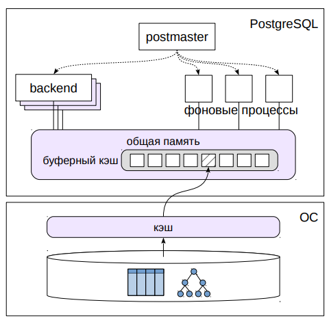
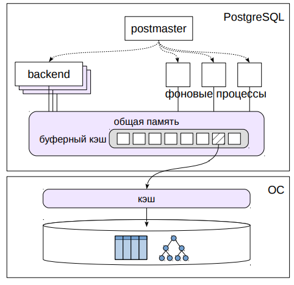
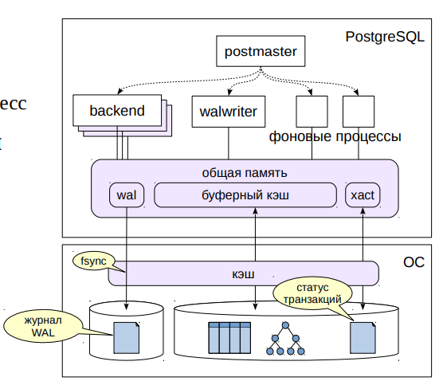
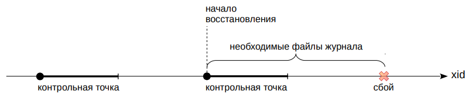
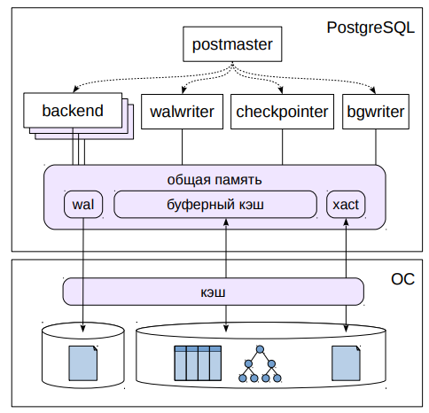

# Буферный кэш и журнал

## Буферный кэш


* Массив буферов
  * страница данных (8 КБ)
  * доп. информация
* Блокировки в памяти
  * для совместного доступа

Буферный кэш используется для сглаживания скорости работы
оперативной памяти и дисков. Он состоит из массива буферов, которые
содержат страницы данных и дополнительную информацию (например,
имя файла и положение страницы внутри этого файла).

Размер страницы обычно составляет 8 КБ; размер можно изменить
только при сборке PostgreSQL.

Любая работа со страницами данных проходит через буферный кэш.
Если какой-либо процесс собирается работать со страницей, он
в первую очередь пытается найти ее в кэше. Если ее нет, он
обращается к операционной системе с просьбой прочитать эту
страницу и помещает ее в буферный кэш. (Обратите внимание, что ОС
может прочитать страницу с диска, а может обнаружить ее в
собственном кэше.)

После того, как странице записана в буферный кэш, к ней можно
обращаться многократно без накладных расходов на вызовы ОС.
Однако буферный кэш, как и другие структуры общей памяти, защищен
блокировками для управления одновременным доступа. Хотя
блокировки и реализованы эффективно, доступ к буферному кэшу
далеко не так быстр, как простое обращение к оперативной памяти.
Поэтому в общем случае чем меньше данных читает и изменяет
запрос, тем быстрее он будет работать.

## Вытеснение


* Вытеснение редко
  * используемых страниц «грязный» буфер записывается на диск
  * на освободившееся место читается другая страница
  
Размер буферного кэша обычно не так велик, чтобы база данных
помещалась в него целиком. Его ограничивают и доступная
оперативная память, и возрастающие при его увеличении накладные
расходы. Поэтому при чтении очередной страницы рано или поздно
окажется, что место в буферном кэше закончилось. В этом случае
применяется вытеснение страниц.

Алгоритм вытеснения выбирает в кэше страницу, которая в последнее
время использовалась реже других, и заменяет ее новой. Если
выбранная страница изменялась, то ее предварительно надо записать
на диск, чтобы не потерять изменения (буфер, содержащий
измененную страницу, называется «грязным»).

Такой алгоритм вытеснения называется LRU — Least Recently Used. Он
сохраняет в кэше данные, с которыми происходит активная работа.
Таких «горячих» данных обычно не так много, и при достаточном
объеме буферного кэша получается существенно сократить количество
обращений к ОС (и дисковых операций).

## Журнал предзаписи (WAL)

Проблема: при сбое теряются данные из оперативной
памяти, не записанные на диск

* Журнал
  * поток информации о выполняемых действиях,
  * позволяющей повторно выполнить потерянные при сбое операции
  * запись попадает на диск раньше, чем измененные данные
* Журнал защищает
  * страницы таблиц, индексов и других объектов
  * статус транзакций (xact)
* Журнал не защищает 
  * временные и нежурналируемые таблицы

Наличие буферного кэша (и других буферов в оперативной памяти)
увеличивает производительность, но уменьшает надежность. В случае
сбоя в СУБД содержимое буферного кэша потеряется. Если сбой
произойдет в операционной системе или на аппаратном уровне, то
пропадет содержимое и буферов ОС (но с этим справляется сама
операционная система).

Для обеспечения надежности PostgreSQL использует журналирование.
При выполнении любой операции формируется запись, содержащая
минимально необходимую информацию для того, чтобы операцию
можно было выполнить повторно. Такая запись должна попасть на диск
(или другой энергонезависимый накопитель) раньше, чем будут
записаны изменяемые операцией данные (поэтому он и называется
журналом предварительной записи).

Файлы журнала традиционно располагались в каталоге
`PGDATA/pg_xlog`; начиная с версии 10 каталог переименован в `pg_wal`.

Журнал защищает все объекты, работа с которыми ведется в
оперативной памяти: таблицы, индексы и другие объекты, статус
транзакций.

В журнал не попадают данные о временных таблицах (такие таблицы
доступны только создавшему из пользователю и только на время
сеанса или транзакции) и о нежурналируемых таблицах (такие
таблицы ничем не отличаются от обычных, кроме того, что не
защищены журналом). В случае сбоя такие таблицы просто очищаются.
Смысл их существования в том, что работа с ними происходит быстрее.

## Производительность



* Синхронный режим
  * запись при фиксации
  * обслуживающий процесс
* Асинхронный режим
  * фоновая запись
  * walwriter

Механизм журналирования более эффективен, чем работа напрямую
с диском без буферного кэша. Во-первых, размер журнальных записей
меньше, чем размер целой страницы данных; во-вторых, журнал
записывается строго последовательно (и не читается, пока не случится
сбой), с чем вполне справляются простые HDD-диски.

На эффективность можно также влиять настройкой. Если запись
происходит сразу (синхронно), то гарантируется, что зафиксированная
транзакция не пропадет. Но запись — довольно дорогая операция,
в течение которой обслуживающий процесс, выполняющий фиксацию,
вынужден ждать. Чтобы журнальная запись не «застряла» в кэше
операционной системы, выполняется вызов fsync: PostgreSQL
полагается на то, что это гарантирует попадание данных на
энергонезависимый носитель.

Поэтому есть и режим отложенной (асинхронной) записи. В этом случае
записи пишутся фоновым процессом walwriter постепенно, с небольшой
задержкой. Надежность уменьшается, зато производительность
увеличивается. Но и в этом случае после сбоя гарантируется
восстановление согласованности.

## Контрольная точка
* Периодический сброс всех грязных буферов на диск
  * гарантирует попадание на диск всех изменений до контрольной точки
  * ограничивает размер журнала, необходимого для восстановления
* Восстановление при сбое
  * начинается с последней контрольной точки
  * последовательно проигрываются записи, если изменений нет на диске



При запуске PostgreSQL после сбоя сервер входит в режим
восстановления. На диске в это время находится несогласованная
информация: одни страницы были записаны в одно время, другие —
в другое.

Чтобы восстановить согласованность, PostgreSQL читает журнал
предзаписи и последовательно проигрывает каждую журнальную
запись, если соответствующее изменение не попало на диск. Таким
образом восстанавливаются все транзакции, кроме тех, запись о
фиксации которых не успела попасть в журнал.

Однако объем журнала за время работы сервера может достигать
гигантских размеров. Хранить его целиком и целиком просматривать
при сбое совершенно не реально. Поэтому СУБД периодически
выполняет контрольную точку: принудительно сбрасывает на диск все
грязные буферы (включая состояние транзакций). Это гарантирует, что
изменения всех транзакций до момента контрольной точки находятся
на диске.

Контрольная точка может занимать много времени, и это нормально.
Собственно «точка», о которой мы говорим как о моменте времени —
это начало процесса. Но точка считается выполненной только после
того, как записаны все грязные буферы, которые имелись на момент
начала процесса.

Восстановление после сбоя начинается с ближайшей контрольной
точки, что позволяет хранить только файлы журнала, записанные
с момента последней пройденной контрольной точки.

## Основные процессы



* Запись журнала
* Контрольная точка
  * сброс всех  грязных буферов
* Фоновая запись
  * сброс части грязных буферов
* Обслуживающие процессы 
  * сброс вытесняемого грязного буфера

Вернемся к иллюстрации и уточним оставшиеся служебные процессы,
связанных с обслуживанием буферного кэша и журнала.

Во-первых, это процесс `walwriter`, занимающийся асинхронной записью
журнала на диск. При синхронном режиме журнальные записи пишет
тот процесс, который выполняет фиксацию транзакции.

Во-вторых, процесс контрольной точки `checkpointer`, периодически
сбрасывающий все грязные буферы на диск.

В-третьих, процесс фоновой записи `bgwriter` (или просто writer). Этот
процесс похож на процесс контрольной точки, но записывает только
часть грязных буферов, причем те, которые с большой вероятностью
будут вытеснены в ближайшее время. Таким образом, когда
обслуживающему процессу понадобится буфер, он скорее всего найдет
его не грязным и не будет терять время на сброс буфера на диск.

И в-четвертых, обслуживающие процессы, читающие данные в
буферный кэш. Если, несмотря на работу процессов контрольной точки
и фоновой записи, вытесняемый буфер окажется грязным,
обслуживающий процесс самостоятельно запишет его на диск.

## Уровни журнала

* `Minimal`
  * гарантия восстановления после сбоя
* `Replica` (по умолчанию)
  * резервное копирование
  * репликация: передача и проигрывание журнала на другом сервере
* `Logical`
  * логическая репликация: информация о добавлении, изменении и удалении табличных строк

Как уже говорилось, причиной появления журнала является
необходимость защищать информацию от сбоев из-за потери
содержимого оперативной памяти.
Однако журнал — механизм, который оказалось удобно применять и
для других целей, если добавить в него дополнительную информацию.
Объем данных, который попадает в журнал, регулируется параметром
`wal_level`.
- На уровне `minimal` журнал обеспечивает только восстановление после
  сбоя. До версии 10 этот уровень устанавливался по умолчанию.


- На уровне `replica` в журнал добавляется информация, позволяющая
  использовать его для создания резервных копий (модуль «Резервное
  копирование») и репликации (модуль «Репликация»). При репликации
  журнальные записи передаются на другой сервер и применяются там;
  таким образом создается и поддерживается точная копия (реплика)
  основного сервера.

> До версии 9.6 существовали два отдельных уровня (`archive` и
  `hot_standby`), но они были объединены в один общий.

- На уровне `logical` в журнал добавляется информация о добавлении,
  изменении и удалении табличных строк. Это позволяет организовать
  более гибкую логическую репликацию (также рассматривается в модуле
  «Репликация»).

## Практика

### Журнал
```shell
# Логический журнал WAL можно представить в виде непрерывного потока записей.
# Каждая запись имеет номер, называемый LSN (Log Sequence Number). Это 64-разрядное
# число - смещение записи в байтах относительно начала журнала.

# Текущую позицию показывает функция pg_current_wal_lsn (до версии 10 она называлась
# pg_current_xlog_location).

=> SELECT pg_current_wal_lsn();
 pg_current_wal_lsn 
--------------------
 0/27C750D0
(1 row)

# Позиция записывается как два 32-разрядных числа через косую черту.

# Запомним позицию в переменной psql:

=> SELECT pg_current_wal_lsn() AS pos1 \gset

# Выполним теперь какие-нибудь операции и посмотрим ак изменилась позиция.

=> CREATE TABLE t1(n integer);
CREATE TABLE

=> INSERT INTO t1 SELECT gen.id FROM generate_series(1,1000) AS gen(id);
INSERT 0 1000

=> SELECT pg_current_wal_lsn();
pg_current_wal_lsn 
--------------------
 0/27C99008
(1 row)

=> SELECT pg_current_wal_lsn() AS pos2\gset

# Удобно смотреть не на абсолютные числа, а на разницу в байтах:

=> SELECT :'pos2'::pg_lsn - :'pos1'::pg_lsn;
 ?column? 
----------
   163664
(1 row)
```

### Журнал
```shell
# Физически журнал хранится в файлах по 16МБ в отдельном каталоге. Начиная с версии 10
# на них можно взглянуть не только в файловой системе (PGDATA/pg_wal) но и с помощью
# функции:

=> SELECT * FROM pg_ls_waldir() ORDER BY name;
           name           |   size   |      modification      
--------------------------+----------+------------------------
 000000010000000000000027 | 16777216 | 2021-10-14 02:33:34+03
 000000010000000000000028 | 16777216 | 2021-10-11 13:16:21+03
 000000010000000000000029 | 16777216 | 2021-10-11 13:16:41+03
 00000001000000000000002A | 16777216 | 2021-10-11 13:16:34+03
 00000001000000000000002B | 16777216 | 2021-10-11 13:16:54+03
 00000001000000000000002C | 16777216 | 2021-10-11 13:16:39+03
 00000001000000000000002D | 16777216 | 2021-10-11 13:16:08+03
 00000001000000000000002E | 16777216 | 2021-10-11 13:16:23+03
 00000001000000000000002F | 16777216 | 2021-10-11 13:16:15+03
 000000010000000000000030 | 16777216 | 2021-10-11 13:16:33+03
 000000010000000000000031 | 16777216 | 2021-10-11 13:16:31+03
 000000010000000000000032 | 16777216 | 2021-10-11 13:16:26+03
 000000010000000000000033 | 16777216 | 2021-10-11 13:16:05+03
 000000010000000000000034 | 16777216 | 2021-10-11 13:16:18+03
 000000010000000000000035 | 16777216 | 2021-10-11 13:16:37+03
 000000010000000000000036 | 16777216 | 2021-10-11 13:16:51+03
 000000010000000000000037 | 16777216 | 2021-10-11 13:16:29+03
 000000010000000000000038 | 16777216 | 2021-10-11 13:16:42+03
 000000010000000000000039 | 16777216 | 2021-10-11 13:16:11+03
 00000001000000000000003A | 16777216 | 2021-10-11 13:16:46+03
(20 rows)

# PostgreSQL удаляет файлы, не требующиеся для восстановления, по мере необходимости.
```

## Итоги

* Буферный кэш существенно ускоряет работу, уменьшая число дисковых операций
* Надежность обеспечивается журналированием
* Размер журнала ограничен благодаря контрольным точкам
* Журнал удобен и используется во многих случаях
  * для восстановления после сбоя
  * при резервном копировании
  * для репликации между серверами