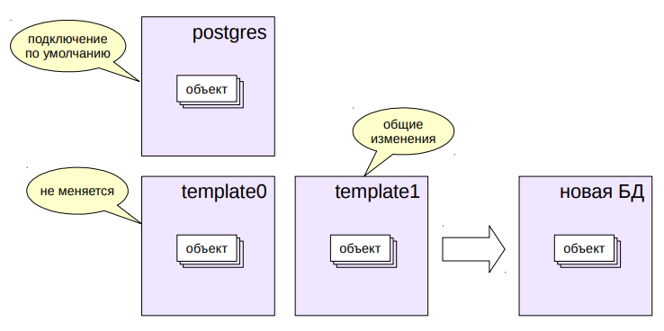
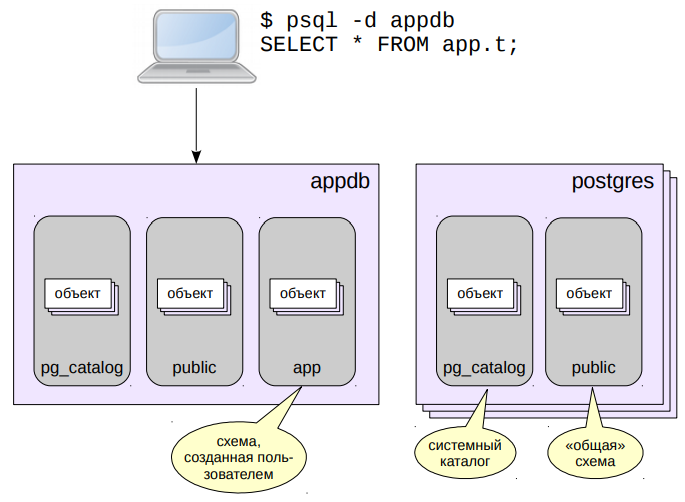

# Базы данных и схемы

## Кластер баз данных

- Инициализация кластера создает три базы данных
- Новая база всегда клонируется из существующей



Экземпляр PostgreSQL управляет несколькими базами данных —
кластером. При инициализации кластера специальным образом
(https://postgrespro.ru/docs/postgresql/10/bki) создаются три одинаковые
базы данных. Все остальные БД, создаваемые пользователем,
клонируются из какой-либо существующей.

Шаблон `template1` используется по умолчанию для создания новых БД.
В него можно добавить объекты и расширения, которые будут
копироваться в каждую новую базу данных.

Шаблон `template0` не должен изменяться. Он нужен как минимум в двух
ситуациях. Во-первых, для восстановления БД из резервной копии,
выполненной pg_dump (так как в эту копию попадут не только объекты
данной БД, но и объекты, установленные в `template1`). Во-вторых, при
создании новой БД с кодировкой, отличной от указанной при
инициализации кластера.

База данных `postgres` используется при подключении по умолчанию
пользователем `postgres`. Она не является обязательной, но некоторые
утилиты предполагают ее наличие, поэтому ее не рекомендуется
удалять, даже если она не нужна.
https://postgrespro.ru/docs/postgresql/10/manage-ag-templatedbs.html

## Схемы

* Пространство имен для объектов внутри базы данных
  * каждый объект принадлежит какой-либо схеме
* Задачи
  * разделение объектов на логические группы
  * предотвращение конфликта имен между приложениями
* Схема и пользователь — разные сущности

Схемы представляет собой пространства имен для объектов БД. Они
позволяют разделить объекты на логические группы для управления
ими, предотвратить конфликты имен при работе нескольких
пользователей или при установке приложений.

Каждый объект, существующий в базе данных, принадлежит какой-либо
схеме.

В PostgreSQL схема и пользователь — разные сущности (хотя
настройки по умолчанию позволяют пользователям удобно работать с
одноименными схемами).

https://postgrespro.ru/docs/postgresql/10/ddl-schemas.html

## Базы и схемы кластера


Кластер состоит из баз данных; база содержит различные схемы, по
которым, в свою очередь, распределены объекты.

Есть некоторое количество стандартных схем, которые существуют
в любой базе данных. Кроме того, пользователь может создавать свои
собственные схемы.

Клиент подключается одновременно только к одной базе данных, но
в этой базе может работать с объектами в любых схемах.

## Путь поиска
* Определение схемы объекта
  * квалифицированное имя (схема.имя) явно определяет схему
  * имя без квалификатора проверяется в схемах, указанных в пути поиска
* Путь поиска
  * задается параметром `search_path`
  * исключаются несуществующие схемы и схемы, к которым нет доступа;
  * подставляются неявно подразумеваемые схемы
  * реальное значение показывает функция `current_schemas`
  * первая явно указанная в пути схема используется для создания объектов

При указании объекта надо определить, о какой схеме идет речь,
поскольку в разных схемах могут храниться объекты с одинаковыми
именами.

Если имя объекта квалифицировано именем схемы, то все просто —
используется явно указанная схема (как на рисунке на предыдущем
слайде). Если имя использовано без квалификатора, PostgreSQL
пытается найти имя в одной из схем, перечисленных в пути поиска,
который определяется конфигурационным параметром `search_path`.

Реальный путь поиска может отличаться от значения параметра
`search_path`. Из указанного пути исключаются несуществующие схемы,
а также схемы, к которым у пользователя нет доступа (этому вопросу
посвящен модуль «Разграничение доступа»). Кроме того, в начало пути
поиска неявно добавляются некоторые специальные схемы.

Реальный путь поиска, включая неявные схемы, возвращает вызов
функции `current_schemas(true)`. Схемы перебираются в указанном
в пути поиска порядке, слева направо. Если в схеме нет объекта с
нужным именем, поиск продолжается в следующей схеме.

При создании нового объекта с именем без квалификатора он попадает
в первую явно указанную в пути схему.

Можно провести аналогию между путем поиска `search_path` и путем
`PATH` в операционных системах.

https://postgrespro.ru/docs/postgresql/10/runtime-config-client.html#guc-search-path

## Специальные схемы
* Схема `public`
  * по умолчанию входит в путь поиска
  * если ничего не менять, все объекты будут в этой схеме
* Схема, совпадающая по имени с пользователем
  * по умолчанию входит в путь поиска, но не существует
  * если создать, объекты пользователя будут в этой схеме
* Схема `pg_catalog`
  * схема для объектов системного каталога
  * если `pg_catalog` нет в пути, она неявно подразумевается первой

Существует несколько специальных схем, обычно присутствующих
в каждой базе данных.

Схема `public` используется по умолчанию для хранения объектов, если
не выполнены иные настройки.

Схема `pg_catalog` хранит объекты системного каталога. Системный
каталог — это метаинформация об объектах, принадлежащих кластеру,
которая хранится в самом кластере в виде таблиц. Альтернативное
представление системного каталога (определенное в стандарте SQL)
дает схема `information_schema`.

В схеме `pg_catalog` находятся объекты системного каталога
(в частности, таблицы `pg_*`).

Если не указать в пути поиска `pg_catalog`, эта схема будет проверяться
первой, чтобы системные объекты были видимы (но после `pg_temp`).

## Специальные схемы

* Временные таблицы
  * существуют на время сеанса или транзакции
  * не журналируются (невозможно восстановление после сбоя)
  * не попадают в общий буферный кэш
* Схема `pg_temp_N`
  * автоматически создается для временных таблиц
  * `pg_temp` — ссылка на конкретную временную схему данного сеанса
  * если `pg_temp` нет в пути, она неявно подразумевается самой первой
  * по окончании сеанса все объекты временной схемы удаляются,
  * а сама схема остается и повторно используется для других сеансов

PostgreSQL умеет работать с временными таблицами. Такие таблицы
предназначены для хранения данных, которые должны быть доступны
только текущему сеансу (и только на время его жизни, или даже на
время текущей транзакции).

Временные таблицы являются нежурналируемыми. Это означает, что
в случае сбоя таблица не может быть восстановлена с помощью
журнала, а вместо будет очищена. Кроме того, страницы таких таблиц
не попадают в общий буферный кэш — работа с ними ведется во
внутренней памяти обслуживающего процесса. Благодаря этому,
работа с временной таблицей происходит несколько более
эффективно, чем с обычной.

Временные таблицы организованы с помощью схем. Для сеанса
создается временная схема с именем `pg_temp_N` (`pg_temp_1`,
`pg_temp_2` и т. п.). Обращаться к ней нужно по имени pg_temp (без
номера) — для каждого сеанса это имя ссылается на конкретную
временную схему.

Если `pg_temp` нет в пути, то эта схема просматривается перед всеми
остальными. При желании можно указать схему `pg_temp` (как и
`pg_catalog`) явно на нужном месте.

После окончания сеанса все объекты временной схемы удаляются,
а сама схема остается для повторного использования.
Есть и другие специальные схемы; они носят более технический
характер.

## Практика

### Базы данных
```shell
# Посмотрим список имеющихся баз:

postgres$ psql -l
                                   List of databases
    Name     |  Owner   | Encoding |   Collate   |    Ctype    |   Access privileges   
-------------+----------+----------+-------------+-------------+-----------------------
 odds_master | postgres | UTF8     | ru_RU.UTF-8 | ru_RU.UTF-8 | 
 postgres    | postgres | UTF8     | ru_RU.UTF-8 | ru_RU.UTF-8 | 
 template0   | postgres | UTF8     | ru_RU.UTF-8 | ru_RU.UTF-8 | =c/postgres          +
             |          |          |             |             | postgres=CTc/postgres
 template1   | postgres | UTF8     | ru_RU.UTF-8 | ru_RU.UTF-8 | =c/postgres          +
             |          |          |             |             | postgres=CTc/postgres
(4 rows)

# Пока нас интересуют только названия, значения остальных полей рассмотрим 
# позже.

# Так же можно посмотреть в самой базе данных:

=> SELECT datname, datistemplate, datallowconn, datconnlimit FROM pg_database;
   datname   | datistemplate | datallowconn | datconnlimit 
-------------+---------------+--------------+--------------
 postgres    | f             | t            |           -1
 template1   | t             | t            |           -1
 template0   | t             | f            |           -1
 odds_master | f             | t            |           -1

# datistemplate - является ли база данных шаблоном;
# datallowconn - разрешены ли соединения с базой данных;
# datconnlimit - максимальное кол-во соединений (-1 - без ограничений)
```

### Создание БД из шаблона
```shell
# Подключимся к шаблонной базе template1:

=> \c template1
You are now connected to database "template1" as user "postgres".

# Проверим доступна ли функция digest, вычисляющая хеш-код текстовой строки:

=> SELECT digest('Hello, world!', 'md5');
ERROR:  function digest(unknown, unknown) does not exist
LINE 1: SELECT digest('Hello, world!', 'md5');
               ^
HINT:  No function matches the given name and argument types. You might need to add explicit type casts.

# Такой функции нет.

# На самом деле digest определена в пакете pgcrypto. Установим его:

=> CREATE EXTENSION pgcrypto;
CREATE EXTENSION

# Если бы расширение pgcrypto не было установлено с помощью make install, мы получили 
# бы ошибку "ERROR: could not open extension control file..."

# Теперь нам доступны функции, входящие в расширение pgcrypto. Например, можно
# вычислить MD5-дайджест:

=> SELECT digest('Hello, world!', 'md5');
               digest               
------------------------------------
 \x6cd3556deb0da54bca060b4c39479839
(1 row)

# Чтобы шаблон можно было использовать для создания базы, к нему не должно быть активных
# подключений, поэтому отключимся от базы template1.

=> \c postgres
You are now connected to database "postgres" as user "postgres".

# Для создания новой базы данных служит команда CREATE DATABASE:

=> CREATE DATABASE db;
CREATE DATABASE

=> \c db;
You are now connected to database "db" as user "postgres".

# Альтернативно можно было бы воспользоваться утилитой createdb:

=> SELECT datname, datistemplate, datallowconn, datconnlimit FROM pg_database;
   datname   | datistemplate | datallowconn | datconnlimit 
-------------+---------------+--------------+--------------
 postgres    | f             | t            |           -1
 template1   | t             | t            |           -1
 template0   | t             | f            |           -1
 odds_master | f             | t            |           -1
 db          | f             | t            |           -1
(5 rows)

# Поскольку для созданя по умолчанию используется шаблон template1, в ней  так же 
# будет доступны функции пакета pgcrypto:

=> SELECT digest('Hello, world!', 'md5');
               digest               
------------------------------------
 \x6cd3556deb0da54bca060b4c39479839
(1 row)
```

### Управление базами данных
```shell
# Созданную базу данных можно переименовать (к ней не должно быть подключений):

=> \c postgres
You are now connected to database "postgres" as user "postgres".

=> ALTER DATABASE db RENAME TO appdb;
ALTER DATABASE

=> SELECT datname, datistemplate, datallowconn, datconnlimit FROM pg_database;
   datname   | datistemplate | datallowconn | datconnlimit 
-------------+---------------+--------------+--------------
 postgres    | f             | t            |           -1
 template1   | t             | t            |           -1
 template0   | t             | f            |           -1
 odds_master | f             | t            |           -1
 appdb       | f             | t            |           -1

# Можно изменить другие параметры, например:

=> ALTER DATABASE appdb CONNECTION LIMIT 10;
ALTER DATABASE

=> SELECT datname, datistemplate, datallowconn, datconnlimit FROM pg_database;
   datname   | datistemplate | datallowconn | datconnlimit 
-------------+---------------+--------------+--------------
 postgres    | f             | t            |           -1
 template1   | t             | t            |           -1
 template0   | t             | f            |           -1
 odds_master | f             | t            |           -1
 appdb       | f             | t            |           10
```

### Размер базы данных
```shell
# Размер базы данных можно узнать с помощью функции:

=> SELECT pg_database_size('appdb');
 pg_database_size 
------------------
          8454947
(1 row)

# Чтобы не считать разряды, можно вывести размер в читаемом виде:

=> SELECT pg_size_pretty(pg_database_size('appdb'));
 pg_size_pretty 
----------------
 8257 kB
(1 row)

# В этой базе данных еще нет пользовательских объектов (кроме расширения pgcrypto);
# фактически, это размер "пустой" базы.
```

### Схемы
```shell
# Список схем можно узнать командой psql (dn = describe namespace):

=> \dn
  List of schemas
  Name  |  Owner   
--------+----------
 public | postgres
(1 row)

# Создадим новую схему:

\c appdb
You are now connected to database "appdb" as user "postgres".

=> CREATE SCHEMA app;
CREATE SCHEMA

=> \dn
  List of schemas
  Name  |  Owner   
--------+----------
 app    | postgres
 public | postgres
(2 rows)

# Если теперь создать таблицу (и не указать имя схемы), в какую схему
# она попадет?

# Надо посмотреть на путь поиска:

=> SHOW search_path;
   search_path   
-----------------
 "$user", public
(1 row)

# Конструкция "$user" обозначает схему с тем же именем, что и имя текущего пользователя
# (в нашем случае - postgres). Поскольку такой схемы нет, она игнорируется.

# Чтобы не думать над тем, какие схемы есть, каких нет, и  какие не указаны явно,
# можно воспользоваться функцией:

=> SELECT current_schemas(true);
   current_schemas   
---------------------
 {pg_catalog,public}
(1 row)

# Теперь создадим таблицу:

=> CREATE TABLE t(s text);
CREATE TABLE

=> INSERT INTO t VALUES ('Я - таблица t');
INSERT 0 1

# Список таблиц можно посмотреть командой \dt:
        List of relations
 Schema | Name | Type  |  Owner   
--------+------+-------+----------
 public | t    | table | postgres
(1 row)

# Объекты можно перемещать между схемами. Поскольку речь идет о логической организации, 
# перемещение происходит только в системном каталоге; сами данные физически остаются 
# на месте.

=> ALTER TABLE t SET SCHEMA app;
ALTER TABLE

# Теперь к таблице t можно обращаться с явным указанием схемы:

=> SELECT * FROM app.t;
       s       
---------------
 Я - таблица t
(1 row)
```

### Путь поиска
```shell
# Установим путь поиска, например, так:

=> SET search_path = public, app;
SET

# Теперь таблица будет найдена.

=> SELECT * FROM t;
       s       
---------------
 Я - таблица t
(1 row)

# Здесь мы установили конфигурационный параметр на уровне сеанса (при переподключении
# значение пропадет). Устанавливать такое значение на уровне кластера тоже не правильно
# возможно, этот путь не всегда и не всем.

=> ALTER DATABASE appdb SET search_path = public, app;
ALTER DATABASE

# Теперь он будет устанавливаться для всех новых подключений к БД appdb.
# Проверим:

=> \c appdb
You are now connected to database "appdb" as user "postgres".

=> SHOW search_path;
 search_path 
-------------
 public, app
(1 row)

=> SELECT current_schemas(true);
     current_schemas     
-------------------------
 {pg_catalog,public,app}
(1 row)
```

### Временные таблицы и pg_temp
```shell
# Создадим временную таблицу:

=> CREATE TEMP TABLE t(s text);
CREATE TABLE

=> \dt
          List of relations
  Schema   | Name | Type  |  Owner   
-----------+------+-------+----------
 pg_temp_3 | t    | table | postgres
(1 row)

# Таблица создана в специальной схеме. Каждому сеансу выделяется отдельная "временная" схема,
# так что он может видеть только свои собственные временные таблицы.

# Но куда пропала обычная таблица t?

# Ответ дает развернутый путь поиска: в него теперь подставлена временная схема,
# и объект в ней "перекрывает" одноименный объект схемы app.

=> SELECT current_schemas(true);
          current_schemas          
-----------------------------------
 {pg_temp_3,pg_catalog,public,app}
(1 row)

=> INSERT INTO t VALUES ('Я - временная таблица');
INSERT 0 1

# Тем не менее, к каждой из таблиц можно обращаться с явным указанием схемы.
# Для временной таблицы надо использовать псевдосхему pg_temp - она автоматически
# отображается в нужную схему pg_temp_N:

=> SELECT * FROM app.t; 
       s       
---------------
 Я - таблица t
(1 row)

=> SELECT * FROM pg_temp.t;
           s           
-----------------------
 Я - временная таблица
(1 row)

# В принципе, во временной схеме можно создавать не только таблицы.

=> CREATE VIEW v AS SELECT * FROM pg_temp.t;
NOTICE:  view "v" will be a temporary view
CREATE VIEW
```

### Временные таблицы и pg_temp
```shell
# Временные таблицы и данные в них могут иметь различные сроки жизни (в 
# зависимости от указания ON COMMIT DELETE/PRESERVE/DROP). В любом случае при
# переключении все объекты во временной схеме уничтожаются:

=> \c appdb
You are now connected to database "appdb" as user "postgres".

=> SELECT current_schemas(true);
     current_schemas     
-------------------------
 {pg_catalog,public,app}
(1 row)

=> SELECT * FROM pg_temp.v;
ERROR:  relation "pg_temp.v" does not exist
LINE 1: SELECT * FROM pg_temp.v;

=> SELECT * FROM pg_temp.t;
ERROR:  relation "pg_temp.t" does not exist
LINE 1: SELECT * FROM pg_temp.t;
```

### Удалени объектов
```shell
# Схему нельзя удалить, если в ней находятся какие-либо объекты:

=> DROP SCHEMA app;
ERROR:  cannot drop schema app because other objects depend on it
DETAIL:  table t depends on schema app
HINT:  Use DROP ... CASCADE to drop the dependent objects too.

# Но можно удалить схему вместе со всеми её объектами:

=> DROP SCHEMA app CASCADE;
NOTICE:  drop cascades to table t
DROP SCHEMA

# Базу данных можно удалить если в ней нет активных соединений:

=> \conninfo
You are connected to database "appdb" as user "postgres" via socket in "/tmp" at port "5432".

=> \c postgres
You are now connected to database "postgres" as user "postgres".

=> DROP DATABASE appdb;
DROP DATABASE
```

## Итоги

* Логически
  * кластер содержит базы данных,
  * базы данных — схемы,
  * схемы — конкретные объекты (таблицы, индексы и т. п.)
* Базы данных создаются клонированием существующих
* Схема указывается явно или определяется по пути поиска
* Некоторые схемы имеют специальное назначение