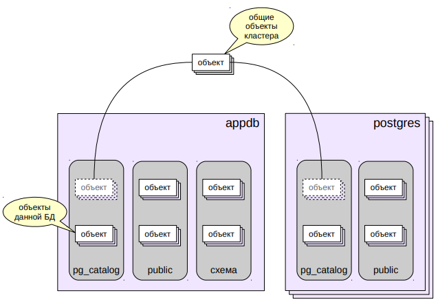
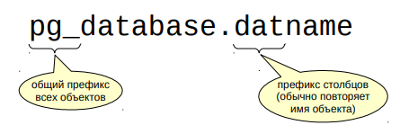

# Системный каталог

## Системный каталог

* Набор таблиц и представлений, описывающих все объекты кластера баз данных
* Схемы
  * основная схема: `pg_catalog`
  * альтернативное представление: `information_schema` (стандарт SQL)
* SQL-доступ
  * просмотр: `SELECT`
  * изменение: `CREATE`, `ALTER`, `DROP`
* Доступ в psql
  * специальные команды для удобного просмотра

Системный каталог представляет собой набор таблиц и представлений
с описанием всех объектов СУБД, «метаинформация» о содержимом
кластера: https://postgrespro.ru/docs/postgresql/10/catalogs.

Для доступа к этой информации используется обычные запросы SQL.
При помощи команд `SELECT` можно получить описание любых
объектов, а при помощи команд `DDL` (Data Definition Language) можно
добавлять и изменять объекты.

Все таблицы и представления системного каталога располагаются
в схеме pg_catalog. Существует и другая схема, предписанная
стандартом SQL: `information_schema`. Она более стабильна и
переносима, чем `pg_catalog`, но не отражает ряд специфических
особенностей PostgreSQL.

Клиентские программы могут читать содержимое системного каталога
и показывать его пользователю в удобном виде. Например,
графические среды разработки и управления обычно изображают
иерархический «навигатор» объектов.

Программа psql тоже предлагает ряд удобных встроенных команд для
работы с системным каталогом. Как правило, эти команды начинаются
на `\d` (от describe). Полный список команд и их описание приведены
в документации (https://postgrespro.ru/docs/postgresql/10/app-psql),
а наиболее часто используемые мы посмотрим в демонстрации.

## Общие объекты кластера



В кластере баз данных, в каждой БД создается свой набор таблиц
системного каталога. Однако существует несколько объектов каталога,
которые являются общими для всего кластера. Наиболее очевидный
пример – список самих баз данных.

Эти таблицы хранятся вне какой-либо базы данных, но при этом
одинаково видны из каждой БД.

Вот список этих объектов:
- базы данных: `pg_database`;
- табличные пространства: `pg_tablespace`;
- роли: `pg_authid`, `pg_auth_members`;
- настройки для ролей и БД: `pg_db_role_settings`;
- подписки логической репликации: `pg_subscription`;
- шаблоны процедурных языков: `pg_pltemplate`;
- зависимости, описания и метки безопасности для общих объектов:
`pg_shdepend`, `pg_shdescription`, `pg_shseclabel`.

Про часть перечисленных таблиц мы будем говорить в других темах.

## Правила именования

Префиксы имен объектов (таблиц, представлений) и столбцов



Названия объектов всегда хранятся в нижнем регистре

Все таблицы и представления системного каталога начинаются
с префикса `«pg_»`. Для предотвращения потенциальных конфликтов,
не рекомендуется создавать объекты, начинающиеся с `«pg_»`.

Названия столбцов имеют трехбуквенный префикс, который, как
правило, соответствует имени таблицы. После префикса нет знака
подчеркивания.

Названия объектов хранятся в нижнем регистре.
Например, `select * from pg_tablespace where spcname = 'pg_global';`

(Все столбцы `pg_tablespace` начинаются с «spc», а название табличного
пространства в условии `where` нужно указывать в нижнем регистре.)

## Специальные типы данных

* OID — тип для идентификатора объекта
  * первичные и внешние ключи в таблицах системного каталога
  * скрытый столбец, в запросах надо указывать явно
* Reg-типы
  * псевдонимы OID для некоторых таблиц системного каталога (`regclass` для `pg_class` и т. п.)
  * приведение текстового имени объекта к типу OID и обратно

Таблицы системного каталога исторически используют в качестве
первичного ключа тип `OID` (Object Identifier).

Это целочисленный тип данных с разрядностью 32 бита (около 4 млрд.
значений) и автоинкрементом. Поскольку значения из этого не слишком
большого диапазона используются для всех строк всех таблиц
системного каталога, не стоит использовать `OID` при создании
собственных таблиц. Вместо этого для суррогатных первичных ключей
надо пользоваться либо типом serial (`smallserial`, `bigserial`), либо
стандартной конструкцией` GENERATED AS IDENTITY` (поддерживается
с версии 10).

`OID` является скрытым столбцом и обычная команда «`SELECT *`» его не
показывает. Для отображения требуется явное указание `OID` в списке
столбцов.

Существует несколько специальных типов данных (фактически
псевдонимов ``OID``), начинающихся на «`reg`», которые позволяют
преобразовывать имена объектов в `OID` и обратно.

https://postgrespro.ru/docs/postgresql/10/datatype-oid.html

## Практика

### Некоторые объекты системного каталога
```shell
# Создадим базу данных и тестовые объекты:

=> CREATE DATABASE data_catalog;
CREATE DATABASE

=> \c data_catalog
You are now connected to database "data_catalog" as user "postgres".

=> CREATE TABLE employees(id serial PRIMARY KEY, name text, manager integer);
CREATE TABLE

=> CREATE VIEW top_managers AS SELECT * FROM employees WHERE manager IS NULL;
CREATE VIEW

# Некотрые таблицы системного каталога нам уже знакомы из пердыдущей темы.
# Это базы данных:

=> SELECT * FROM pg_database WHERE datname = 'data_catalog'\gx
-[ RECORD 1 ]-+-------------
oid           | 106496
datname       | data_catalog
datdba        | 10
encoding      | 6
datcollate    | ru_RU.UTF-8
datctype      | ru_RU.UTF-8
datistemplate | f
datallowconn  | t
datconnlimit  | -1
datlastsysoid | 13009
datfrozenxid  | 726
datminmxid    | 1
dattablespace | 1663
datacl        | 

# И схемы:

=> SELECT * FROM pg_namespace WHERE nspname = 'public'\gx
-[ RECORD 1 ]---------------------------------
oid      | 2200
nspname  | public
nspowner | 10
nspacl   | {postgres=UC/postgres,=UC/postgres}

# Важная таблица pg_class хранит описание целого ряда объектов: таблиц, представлений
# включая материализованые), индексов, последовательностей. Все эти объекты называются
# в PostgreSQL общим словом "отношение" (relation), отсюда и префикс 'rel' в названии
# столбцов:

=> SELECT relname, relkind, relnamespace, relfilenode, relowner, reltablespace
   FROM pg_class WHERE relname ~ '^(emp|top).*';
     relname      | relkind | relnamespace | relfilenode | relowner | reltablespace 
------------------+---------+--------------+-------------+----------+---------------
 employees_id_seq | S       |         2200 |      106497 |       10 |             0
 employees        | r       |         2200 |      106498 |       10 |             0
 employees_pkey   | i       |         2200 |      106504 |       10 |             0
 top_managers     | v       |         2200 |           0 |       10 |             0
(4 rows)

# Типы объектов различаются по столбцу relkind.

# Конечно, для каждого типа объектов имеет смысл только часть столбцов; кроме
# того, удобнее смотреть не на многочисленные OID, а на нормальные значения. 
# Для этого существуют различные представления, например:

=> SELECT schemaname, tablename, tableowner, tablespace
   FROM pg_tables WHERE schemaname = 'public';
    schemaname | tablename | tableowner | tablespace 
------------+-----------+------------+------------
 public     | employees | postgres   | 
(1 row)

=> SELECT * FROM pg_views WHERE schemaname = 'public';
 schemaname |   viewname   | viewowner |              definition              
------------+--------------+-----------+--------------------------------------
 public     | top_managers | postgres  |  SELECT employees.id,               +
            |              |           |     employees.name,                 +
            |              |           |     employees.manager               +
            |              |           |    FROM employees                   +
            |              |           |   WHERE (employees.manager IS NULL);
(1 row)
```

### Использование команд psql
```shell
# Список всех 'отношений' можно посмотреть командой \d* в psql, где 
# * - символ обозначающий тип объекта (как relkind). Например, таблицы:

=> \dt
           List of relations
 Schema |   Name    | Type  |  Owner   
--------+-----------+-------+----------
 public | employees | table | postgres
(1 row)

=> \dv
            List of relations
 Schema |     Name     | Type |  Owner   
--------+--------------+------+----------
 public | top_managers | view | postgres
(1 row)

# Эти команды можно снабдить модификатором '+', чтобы получить
# больше информации:

=> \dt+
                                       List of relations
 Schema |   Name    | Type  |  Owner   | Persistence | Access method |    Size    | Description 
--------+-----------+-------+----------+-------------+---------------+------------+-------------
 public | employees | table | postgres | permanent   | heap          | 8192 bytes | 
(1 row)

# Чтобы получить детальную информацию о конкретном объекте, надо воспользоваться
# командой \d (без дополнительной буквы):

=> \d top_managers
             View "public.top_managers"
 Column  |  Type   | Collation | Nullable | Default 
---------+---------+-----------+----------+---------
 id      | integer |           |          | 
 name    | text    |           |          | 
 manager | integer |           |          | 

=> \d+ top_managers
                         View "public.top_managers"
 Column  |  Type   | Collation | Nullable | Default | Storage  | Description 
---------+---------+-----------+----------+---------+----------+-------------
 id      | integer |           |          |         | plain    | 
 name    | text    |           |          |         | extended | 
 manager | integer |           |          |         | plain    | 
View definition:
 SELECT employees.id,
    employees.name,
    employees.manager
   FROM employees
  WHERE employees.manager IS NULL;

# Помимо 'отношений', аналогичным образом можно смотреть и на другие объекты,
# такие, как схемы (\dn) или функции (\df).

# Модификатор 'S' позволяет вывести не пользовательские, но и системные объекты.
# А с помощью шаблона можно ограничить выборку:

=> \dfS pg*size
                                  List of functions
   Schema   |          Name          | Result data type | Argument data types | Type 
------------+------------------------+------------------+---------------------+------
 pg_catalog | pg_column_size         | integer          | "any"               | func
 pg_catalog | pg_database_size       | bigint           | name                | func
 pg_catalog | pg_database_size       | bigint           | oid                 | func
 pg_catalog | pg_indexes_size        | bigint           | regclass            | func
 pg_catalog | pg_relation_size       | bigint           | regclass            | func
 pg_catalog | pg_relation_size       | bigint           | regclass, text      | func
 pg_catalog | pg_table_size          | bigint           | regclass            | func
 pg_catalog | pg_tablespace_size     | bigint           | name                | func
 pg_catalog | pg_tablespace_size     | bigint           | oid                 | func
 pg_catalog | pg_total_relation_size | bigint           | regclass            | func

# psql предлагает большое количество команд для прссмотра системного каталога.
# Как правило, они имеют мнемонические имена. Например, \df - describe function,
# \sf - show function:

=> \sf pg_catalog.pg_database_size(oid)
CREATE OR REPLACE FUNCTION pg_catalog.pg_database_size(oid)
 RETURNS bigint
 LANGUAGE internal
 PARALLEL SAFE STRICT
AS $function$pg_database_size_oid$function$

# Полный список всегда можно посмотреть в документации или командой \?.
```

### Изучение структуры системного каталога
```shell
# Все команды psql, описывающие объекты
```

### TITLE
```shell

```

### TITLE
```shell

```

### TITLE
```shell

```

## Итоги

* Системный каталог — метаинформация о кластере
в самом кластере
* SQL-доступ и дополнительные команды psql
* Часть таблиц системного каталога хранится в базах данных,
часть — общая для всего кластера
* Системный каталог использует специальные типы данных