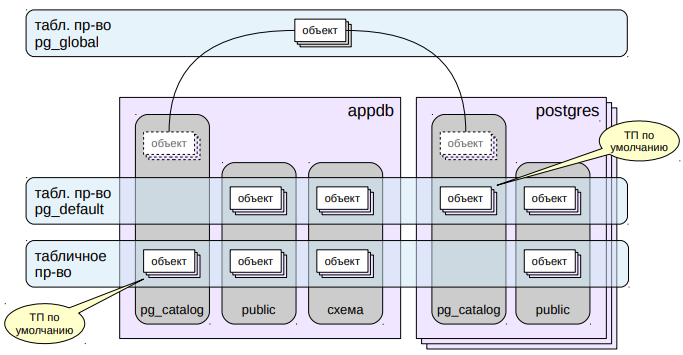
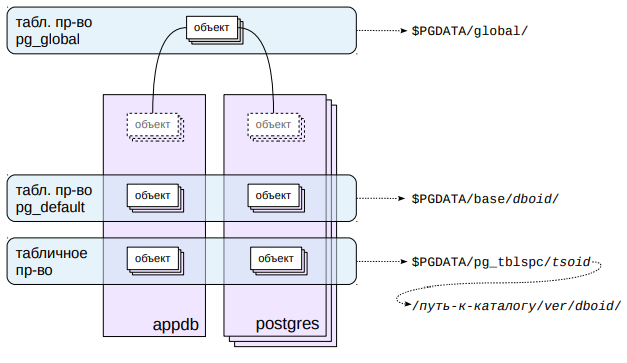

# Табличные пространства

## Табличные пространства



Табличные пространства (ТП) служат для организации физического
хранения данных и определяют расположение данных в файловой
системе.

Например, можно создать одно ТП на медленных дисках для архивных
данных, а другое – на быстрых дисках для данных, с которыми идет
активная работа.

При инициализации кластера создаются два ТП: `pg_default` и `pg_global`.
Одно и то же ТП может использоваться разными базами данных, а одна
база данных может хранить данные в нескольких ТП.

При этом у каждой БД есть так называемое «ТП по умолчанию», в
котором создаются все объекты, если явно не указать иное. В этом же
ТП хранятся и объекты системного каталога. Изначально в качестве
«ТП по умолчанию» используется ТП `pg_default`, но можно установить и
другое.

ТП `pg_global` особенное: в нем хранятся те объекты системного
каталога, которые являются общими для кластера.
https://postgrespro.ru/docs/postgresql/10/manage-ag-tablespaces

## Каталоги



По сути, табличное пространство — это указание на каталог, в котором
располагаются данные. Стандартные ТП `pg_global` и `pg_default` всегда
находятся в `$PGDATA/global/` и `$PGDATA/base/` соответственно. При
создании пользовательского ТП указывается произвольный каталог; для
собственного удобства PostgreSQL создает на него символьную ссылку
в каталоге `$PGDATA/pg_tblspc/`.

Внутри каталога `$PGDATA/base/` данные дополнительно разложены по
подкаталогам баз данных (для `$PGDATA/global/` это не требуется, как
так данные в нем относятся к кластеру в целом).

Внутри каталога пользовательского ТП появляется еще один уровень
вложенности: версия сервера PostgreSQL. Это сделано для удобства
обновления сервера на другую версию.

Собственно объекты хранятся в файлах внутри этих каталогов —
каждый объект в отдельных файлах.

## Практика

### Служебные таблицчные пространства
```shell
# При создании кластера создаются два табличных пространства:

=> SELECT * FROM pg_tablespace;
 oid  |  spcname   | spcowner | spcacl | spcoptions 
------+------------+----------+--------+------------
 1663 | pg_default |       10 |        | 
 1664 | pg_global  |       10 |        | 
(2 rows)

# pg_global - общие объекты кластера.
# pg_default - табличное простанство по умолчанию.
```

### Пользовательские табличные пространства
```shell
# Для нового табличного пространства нужен пустой каталог, владельцем которого
# является пользователь postgres.

=> \! mkdir ts_dir

# Теперь можно создать табличное пространство:

=> CREATE TABLESPACE ts LOCATION '/var/lib/postgresql/ts_dir';
CREATE TABLESPACE

# Список доступных табличных пространств можно получить и командой psql:
=> \db
                List of tablespaces
    Name    |  Owner   |          Location          
------------+----------+----------------------------
 pg_default | postgres | 
 pg_global  | postgres | 
 ts         | postgres | /var/lib/postgresql/ts_dir
(3 rows)

# У каждой базы данных есть табличное пространство по умолчанию:

# Создадим БД и назначим ей ts в качестве такого пространства:

=> CREATE DATABASE appdb TABLESPACE ts;
CREATE DATABASE

# Теперь все создаваемые таблицы и индексы будут попадать в ts, если явно не 
# указать другое.

# Подключимся к базе:

=> \c appdb
You are now connected to database "appdb" as user "postgres".

# Создадим таблицу:
=> CREATE TABLE t1(id serial, name text);
CREATE TABLE

# При создании объекта табличное пространство можно указать явно:

=> CREATE TABLE t2(n numeric) TABLESPACE pg_default;
CREATE TABLE

=> SELECT tablename, tablespace FROM pg_tables WHERE schemaname = 'public';
 tablename | tablespace 
-----------+------------
 t1        | 
 t2        | pg_default
(2 rows)

# Пустое поле tablespace указывает на табличное пространство по умолчанию, 
# а у второй таблицы поле заполнено.

# Одно табличное пространство может использоваться для объектов нескольких
# баз данных.

=> CREATE DATABASE configdb;
CREATE DATABASE

# У этой БД табличным пространством по умолчанию будет pg_default.

=> \c configdb
You are now connected to database "configdb" as user "postgres".

=> CREATE TABLE t(n integer) TABLESPACE ts;
CREATE TABLE
```

### Управление объектами в табличных пространствах
```shell
# Таблицы (и другие обхекты,  например, индексы), можно перемещать между 
# табличными пространствами.

=> \c appdb
You are now connected to database "appdb" as user "postgres".

=> ALTER TABLE t1 SET TABLESPACE pg_default;
ALTER TABLE

=> SELECT tablename, tablespace FROM pg_tables WHERE schemaname = 'public';
 tablename | tablespace 
-----------+------------
 t2        | pg_default
 t1        | pg_default
(2 rows)

# Можно поместить и все объекты из одного табличного пространства в другое:

=> ALTER TABLE ALL IN TABLESPACE pg_default SET TABLESPACE ts;
ALTER TABLE

=> SELECT tablename, tablespace FROM pg_tables WHERE schemaname = 'public';
 tablename | tablespace 
-----------+------------
 t2        | 
 t1        | 
(2 rows)

# Важно понимать, что перенос в другое табличное пространство (в отличии
# от переноса в другую схему) - физическая операция, связанная с копированием
# файлов данных из каталога в каталог. На время ее выполнения перемешаемый
# объект полностью блокируется.
```

### Размер табличного пространства
```shell
# Мы уже рассматривали, как узнать объем, занимаемый базой данных. Объем можно 
# посмотреть и в разделе табличных пространсв:

=> SELECT pg_size_pretty(pg_tablespace_size('ts'));
 pg_size_pretty 
----------------
 8345 kB
(1 row)

# Почему такой размер, если в табличном пространстве всего несколько пустых
# таблиц?

# Поскольку ts является табличным пространством по умолчанию для базы appdb,
# в нем хранятся объекты системного каталога. Они и занимают место.
```

### Удаление табличного пространства
```shell
# Табличное пространство можно удалить, но только в том случае, если оно пустое.

=> DROP TABLESPACE ts;
ERROR:  tablespace "ts" is not empty

# В отличии от удаления схемы, в команде DROP TABLESPACE нельзя использовать
# фразу CASCADE: объекты табличного пространства могут пренадлежать разным
# базам данных, а подключены мы только к одной.

# Но можно выяснить, в каких базах есть зависимые объекты. В этом нам поможет 
# системный каталог.

# Сначала узнаем и запомним OID табличного пространства:

=> SELECT OID FROM pg_tablespace WHERE spcname = 'ts';
  oid   
--------
 114688
(1 row)

=> SELECT OID AS tsoid FROM pg_tablespace WHERE spcname = 'ts'\gset

# Затем получим список баз данных, в которых есть объекты из удаляемого 
# прсотранства:

=> SELECT datname FROM pg_database WHERE OID IN (SELECT pg_tablespace_databases(:tsoid));
 datname  
----------
 appdb
 configdb
(2 rows)

# Далее подключаемся к каждой базе и получаем список объектов pg_class:

=> \c configdb
You are now connected to database "configdb" as user "postgres".

=> SELECT relnamespace::regnamespace, relname, relkind
   FROM pg_class
   WHERE reltablespace = :tsoid;
    relnamespace | relname | relkind 
--------------+---------+---------
 public       | t       | r
(1 row)

# Таблица больше не нужна, удалим её:

=> DROP TABLE t;
DROP TABLE

# И вторая база данных. Но, поскольку ts является табличным пространством по
# умолчанию, у объектов в pg_class поле содержит ноль:

\с appdb
You are now connected to database "appdb" as user "postgres".

=> SELECT count(*) FROM pg_class WHERE reltablespace = 0;
 count 
-------
   360
(1 row)

# Это как нам известно, объекты системного каталога.

# Табличное пространство по умолчанию можно сменить; при этом все таблицы
# из старого пространства физически переносятся в новое. Предварительно надо
# отключиться от базы.

=> \c postgres
You are now connected to database "postgres" as user "postgres".

=> ALTER DATABASE appdb SET TABLESPACE pg_default;
ALTER DATABASE

# После этого табличное пространство может быть удалено:

\c appdb
You are now connected to database "appdb" as user "postgres".

=> DROP TABLESPACE ts;
DROP TABLESPACE
```

## Итоги
- Табличные пространства — средство для организации  физического хранения данных.
- Логическое (базы данных, схемы) и физическое (табличные пространства) разделения данных независимы.