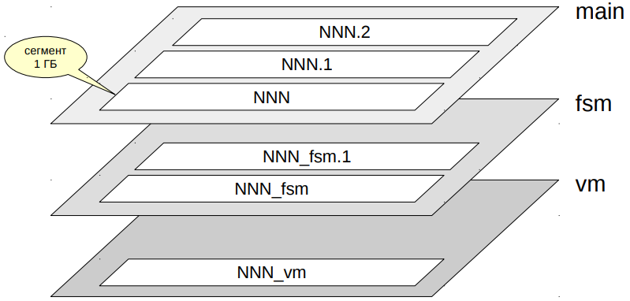
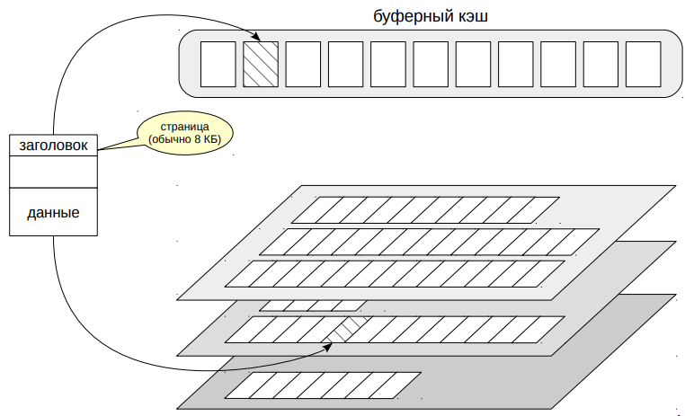

# Низкий уровень

## Слои объекта



Обычно каждому объекту БД, хранящему данные (таблице, индексу,
последовательности, материализованному представлению),
соответствует несколько слоев (forks). Каждый слой содержит
определенный вид данных.

Вначале слой содержит один-единственный файл. Имя файла состоит
из числового идентификатора, к которому может быть добавлено
окончание, соответствующее имени слоя.

Файл постепенно растет и, когда его размер доходит до 1 ГБ, создается
следующий файл этого же слоя. Такие файлы иногда называют
сегментами. Порядковый номер сегмента добавляется в конец имени
файла.

Ограничение размера файла в 1 ГБ возникло исторически для
поддержки различных файловых систем, некоторые из которых не
умеют работать с файлами большого размера.

Таким образом, одному объекту БД на диске может соответствовать
несколько файлов. Для небольшой таблицы их будет 3, для индекса —
два. Все файлы объектов, принадлежащих одному табличному
пространству и одной БД, будут помещены в один каталог. Это
необходимо учитывать, потому что файловые системы могут не очень
хорошо работать с большим количеством файлов в каталоге.

## Страницы файлов



Файлы, в свою очередь, разделены на страницы (иногда используется
термин блок). Страница обычно имеет размер 8 КБ. Его в некоторых
пределах можно поменять (16 КБ или 32 КБ), но только при сборке.
Собранный и запущенный кластер может работать со страницами
только одного размера.

Независимо от того, к какому слою принадлежат файлы, они
используются буферным менеджером примерно одинаково. Страницы
сначала читаются в буферный кэш, там их могут читать и изменять
процессы PostgreSQL, затем при необходимости страницы вытесняются
обратно на диск.

Каждая страница имеет внутреннюю разметку. Она содержит заголовок
и полезные данные; между ними может находиться свободное
пространство, если страница занята не полностью.

## Слои

* Основной
  * собственно данные (версии строк)
  * существует для всех объектов
* Инициализации (init)
  * заготовка пустого основного слоя
  * используется при сбое; только для нежурналируемых таблиц

Посмотрим теперь на типы слоев.

Основной слой — это собственно данные: версии строк таблиц или
строки индексов. Имена файлов основного слоя состоят только из
идентификатора без дополнительного окончания.

Основной слой существует для любых объектов.

Слой инициализации имеет окончание _`init`. Этот слой существует
только для нежурналируемых таблиц (созданных с указанием
`UNLOGGED`) и их индексов. Такие объекты ничем не отличаются от
обычных, кроме того, что действия с ними не записываются в журнал
упреждающей записи. За счет этого работа с ними происходит быстрее,
но в случае сбоя их содержимое невозможно восстановить. Поэтому
при восстановлении PostgreSQL просто удаляет все слои таких
объектов и записывает слой инициализации на место основного слоя.
В результате получается пустая таблица.

## Слои

* Карта свободного пространства (fsm)
  * отмечает свободное пространство в страницах после очистки
  * используется при вставке новых версий строк
  * существует для всех объектов

Слой `fsm` (free space map) — карта свободного пространства.

В ней отмечено наличие пустого места внутри страниц. Это место
постоянно меняется: при добавлении новых версий строк уменьшается,
при очистке — увеличивается.

Карта свободного пространства используется при вставке новых версий
строк, чтобы быстро найти подходящую страницу, на которую
поместятся добавляемые данные.

https://postgrespro.ru/docs/postgresql/10/storage-fsm

## Слои

* Карта видимости (vm)
  * отмечает страницы, на которых все версии строк видны во всех снимках
  * используется для оптимизации работы процесса очистки и ускорения индексного доступа
  * существует только для таблиц

Слой `vm` (visibility map) — битовая карта видимости. В ней отмечены
страницы, которые содержат только актуальные версии строк, видимые
во всех снимках данных. Иными словами, это страницы, которые давно
не изменялись и успели полностью очиститься от неактуальных версий.

Карта видимости применяется для оптимизации очистки (отмеченные
страницы не нуждаются в очистке) и для ускорения индексного доступа.
Дело в том, что информация о версионности хранится только для
таблиц, но не для индексов (поэтому у индексов не бывает карты
видимости). Получив из индекса ссылку на версию строки, нужно
прочитать табличную страницу, чтобы проверить ее видимость. Но если
в самом индексе уже есть все нужные столбцы, и при этом страница
отмечена в карте видимости, то к таблице можно не обращаться.

Начиная с версии 9.6 в этом же слое хранится и так называемая карта
заморозки. Про нее речь идет в модуле «Задачи администрирования»,
тема «Сопровождение».
https://postgrespro.ru/docs/postgresql/10/storage-vm

## TOAST

* Версия строки должна помещаться на одну страницу
  * можно сжать часть атрибутов,
  * или вынести в отдельную TOAST-таблицу,
  * или сжать и вынести одновременно
* TOAST-таблица
  * схемы `pg_toast`, `pg_toast_temp_N`
  * таблица поддержана собственным индексом
  * «длинные» атрибуты разделены на части размером меньше страницы
  * читается только при обращении к «длинному» атрибуту
  * собственная версионность
  * работает прозрачно для приложения

Любая версия строки в PostgreSQL должна целиком помещаться на
одну страницу. Для «длинных» версий строк применяется технология
`TOAST — The Oversized Attributes Storage Technique`. Она
подразумевает несколько стратегий. Подходящий «длинный» атрибут
может быть сжат так, чтобы версия строки поместилась на страницу.
Если это не получается, версия строки может быть отправлена в
отдельную служебную таблицу. Могут применяться и оба подхода.

Для каждой основной таблицы при необходимости создается отдельная
TOAST-таблица (и к ней специальный индекс). Такие таблицы и
индексы располагаются в отдельной схеме `pg_toast` и поэтому обычно
не видны (для временных таблиц используется схема `pg_toast_temp_N`
аналогично обычной `pg_temp_N`).

Версии строк в TOAST-таблице тоже должны помещаться на одну
страницу, поэтому «длинные» значения хранятся порезанными на
части. Из этих частей PostgreSQL прозрачно для приложения
«склеивает» необходимое значение.

TOAST-таблица используется только при обращении к «длинному»
значению. Кроме того, для toast-таблицы поддерживается своя
версионность: если обновление данных не затрагивает «длинное»
значение, новая версия строки будет ссылаться на то же самое
значение в TOAST-таблице — это экономит место.
 
https://postgrespro.ru/docs/postgresql/10/storage-toast

## Практика

### Расположение файлов
```shell
# Посмотрим на файлы, принадлежащие таблице:

=> CREATE DATABASE data_lowlevel; 
CREATE DATABASE

=> \c data_lowlevel
You are now connected to database "data_lowlevel" as user "postgres".

=> CREATE TABLE t(id serial PRIMARY KEY, n numeric);
CREATE TABLE

=> INSERT INTO t(n) SELECT g.id FROM generate_series(1, 10000) AS g(id);
INSERT 0 10000

# Базовое имя файла относительно PGDATA можно получить функцией:

=> SELECT pg_relation_filepath('t');
 pg_relation_filepath 
----------------------
 base/114715/114717
(1 row)

# Поскольку таблица находится в табличном пространстве pg_default, имя начинается
# на base. Затем идет каталог для базы данных:

=> SELECT OID FROM pg_database WHERE datname = 'data_lowlevel';
  oid   
--------
 114715
(1 row)

# Затем - собственно имя файла. Его можно узнать следующим образом:

=> SELECT relfilenode FROM pg_class WHERE relname = 't';
 relfilenode 
-------------
      114717
(1 row)

# Тем и удобна функция, что выдает готовый путь без необходимости выполнять
# несколько запросов к системному каталогу.

# Посмотрим на файлы:

=> \! ls /usr/local/pgsql/data/base/114715/114717*
/usr/local/pgsql/data/base/114715/114717  
/usr/local/pgsql/data/base/114715/114717_fsm
/usr/local/pgsql/data/base/114715/114717_vm

# Сейчас мы видим только два слоя: основной и карта свободного пространства.
# Карта видимости появляется только после выполнения очистки:

=> VACUUM t;
VACUUM

=> \! ls /usr/local/pgsql/data/base/114715/114717*
/usr/local/pgsql/data/base/114715/114717  
/usr/local/pgsql/data/base/114715/114717_fsm
/usr/local/pgsql/data/base/114715/114717_vm

# Аналогично можно посмотреть и на файлы индекса:

=> \d t
                            Table "public.t"
 Column |  Type   | Collation | Nullable |            Default            
--------+---------+-----------+----------+-------------------------------
 id     | integer |           | not null | nextval('t_id_seq'::regclass)
 n      | numeric |           |          | 
Indexes:
    "t_pkey" PRIMARY KEY, btree (id)

=> SELECT pg_relation_filepath('t_pkey');
 pg_relation_filepath 
----------------------
 base/114715/114723
(1 row)

=> \! ls /usr/local/pgsql/data/base/114715/114723*
/usr/local/pgsql/data/base/114715/114723

# ... и на файлы последовательности

=> SELECT pg_relation_filepath('t_id_seq');
 pg_relation_filepath 
----------------------
 base/114715/114716
(1 row)

=> \! ls /usr/local/pgsql/data/base/114715/114716*
/usr/local/pgsql/data/base/114715/114716
```

### Размер объектов и слоев
```shell
# Размер каждого из файлов, входящих в слой, можно, конечно, посмотреть в 
# файловой системе, но существуют и специальные функции.

# Размер каждого слоя в отдельности:

=> SELECT pg_relation_size('t', 'main') main, 
   pg_relation_size('t', 'fsm') fsm,
   pg_relation_size('t', 'vm') vm;
     main  |  fsm  |  vm  
--------+-------+------
 450560 | 24576 | 8192
(1 row)

# Размер таблиц без индексов:

=> SELECT pg_table_size('t');
 pg_table_size 
---------------
        491520
(1 row)

# Размер индексов таблицы

=> SELECT pg_indexes_size('t');
 pg_indexes_size 
-----------------
          245760
(1 row)

# И размер всей таблицы, включая индексы:

=> SELECT pg_total_relation_size('t');
 pg_total_relation_size 
------------------------
                 737280
(1 row)
```

### TOAST
```shell
# В таблице t есть столбец типа numeric. Этот тип может работать с очень 
# большими числами. Например, с такими:

=> SELECT length((123456789::numeric ^ 12345::numeric)::text);
 length 
--------
  99907
(1 row)

# При этом, если вставить такое значение в таблицу, размер файлов не изменится:

=> SELECT pg_relation_size('t', 'main');
 pg_relation_size 
------------------
           450560
(1 row)

=> INSERT INTO t(n) SELECT 123456789::numeric ^ 12345::numeric;
INSERT 0 1

=> SELECT pg_relation_size('t', 'main');
 pg_relation_size 
------------------
           450560
(1 row)

# Поскольку версия строки не помещается на одну страницу, она хранится в 
# отдельной TOAST-таблице. TOAST-таблица и индекс к ней создаются автоматически
# для каждой таблицы, в которой есть потенциально "длинный" тип данных,
# и используются по необходимости.

# Имя и индентификатор такой таблицы можно найти следующим образом:

=> SELECT relname, relfilenode FROM pg_class
   WHERE OID = (SELECT reltoastrelid FROM pg_class WHERE relname = 't');
        relname     | relfilenode 
-----------------+-------------
 pg_toast_114717 |      114721
(1 row)

# Вот и файлы TOAST-таблицы:

=> \! ls /usr/local/pgsql/data/base/114715/114721*
/usr/local/pgsql/data/base/114715/114721
/usr/local/pgsql/data/base/114715/114721_fsm

# Существует несколько стратегий работы с длинными значениями. Название стратегий 
# указывается в поле Storage:


=> \d+ t
                                                       Table "public.t"
 Column |  Type   | Collation | Nullable |            Default            | Storage | Compression | Stats target | Description 
--------+---------+-----------+----------+-------------------------------+---------+-------------+--------------+-------------
 id     | integer |           | not null | nextval('t_id_seq'::regclass) | plain   |             |              | 
 n      | numeric |           |          |                               | main    |             |              | 
Indexes:
    "t_pkey" PRIMARY KEY, btree (id)
Access method: heap

# plain - TOAST не применяется (тип имеет фиксированную длину);
# main - приоритет сжатия;
# extended - применяется как сжатие, так и отедальное хранение;
# external - только отдельно хранение без сжатия.

# Стратегию можно изменить, если это необходимо. Например, если известно,
# что в столбце хранятся уже сжатые данные, разумно поставить стратегию external.

# Просто для примера:

=> ALTER TABLE t ALTER COLUMN n SET STORAGE extended;
ALTER TABLE

# Эта операция не меняет существующие данные в таблице, но определяет стратегию
# работы с новыми данными.
```

## Итоги
- Объект представлен несколькими слоями
- Слой состоит из одного или нескольких файлов-сегментов
- Каждый файл разбит на страницы
- Для «длинных» версий строк используется TOAST

