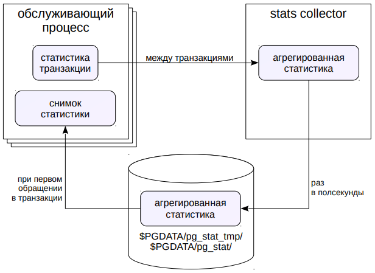

# Мониторинг работы

## Средства ОС

* Процессы
  * `ps` (grep postgres)
  * параметр `update_process_title` для обновления статуса процессов
* Использование ресурсов
  * `iostat`, `vmstat`, `sar`, `top`...
* Дисковое пространство
  * `df`, `du`, `quota`...

PostgreSQL работает под управлением операционной системы и
в известной степени зависит от ее настроек.

Unix предоставляет множество инструментов для анализа состояния и
производительности.

В частности, можно посмотреть процессы, принадлежащие PostgreSQL.
Это особенно полезно при включенном (по умолчанию) параметре
сервера `update_process_title`, когда в имени процесса отображается его
текущее состояние.

Для изучения использования системных ресурсов (процессор, память,
диски) имеются различные инструменты: `iostat`, `vmstat`, `sar`, `top` и др.

Необходимо следить и за размером дискового пространства. Место,
занимаемое базой данных, можно смотреть как из самой БД (см.
модуль «Организация данных»), так из ОС (команда `du`). Размер
доступного дискового пространства надо смотреть в ОС (команда df).
Если используются дисковые квоты, надо принимать во внимание и их.

В целом набор инструментов и подходы может сильно различаться
в зависимости от используемой ОС и файловой системы, поэтому
подробно здесь не рассматриваются.

https://postgrespro.ru/docs/postgresql/10/monitoring-ps

https://postgrespro.ru/docs/postgresql/10/diskusage

## Статистика внутри базы

- Текущие активности системы
- Процесс сбора статистики
- Дополнительные расширения

Существует два основных источника информации о происходящем
в системе. Первый из них — статистическая информация, которая
собирается PostgreSQL и хранится внутри базы данных.

## Текущие активности

Настройка

| Статистика  | Параметр |
| ------------- | ------------- |
| текущая активность и ожидания обслуживающих и фоновых процессов | `track_activities` включен по умолчанию  |

Текущая активность всех обслуживающих процессов и (начиная
с версии 10) фоновых процессов отображается в представлении
`pg_stat_activity`. Подробнее на нем мы остановимся в демонстрации.

Кроме этого, есть еще несколько представлений, показывающих
текущие активности сервера (работу очистки, репликации и т. п.).

Работу этих представлений можно отключить параметром
`track_activities`, но делать этого не следует.

## Сбор статистики

Настройки процесса `stats collector`

| Статистика  | Параметр |
| ------------- | ------------- |
| обращения к таблицам и индексам (доступы, затронутые строки)  | `track_counts` включен по умолчанию и нужен для автоочистки  |
| обращения к страницам  | `track_io_timing` выключен по умолчанию  |
| вызовы пользовательских функций | `track_functions` выключен по умолчанию | 

Кроме показа действий, непосредственно происходящих в данный
момент, PostgreSQL собирает и некоторую статистику.

Сбором статистики занимается фоновый процесс `stats collector`.
Количеством собираемой информации управляют несколько
параметров сервера, так как чем больше информации собирается, тем
больше и накладные расходы.

https://postgrespro.ru/docs/postgresql/10/monitoring-stats

## Архитектура



Каждый обслуживающий процесс собирает необходимую статистику
в рамках каждой выполняемой транзакции. Затем эта статистика
передается процессу-коллектору. Коллектор собирает и агрегирует
статистику со всех обслуживающих процессов. Раз в полсекунды
(время настраивается при компиляции) коллектор сбрасывает
статистику во временные файлы в каталог `$PGDATA/pg_stat_tmp`.
(Поэтому перенесение этого каталога в файловую систему в памяти
может положительно сказаться на производительности.)

Когда обслуживающий процесс запрашивает информацию о статистике
(через представления или функции), в его память читается последняя
доступная версия статистики — это называется снимком статистики.
Если не попросить явно, снимок не будет перечитываться до конца
транзакции, чтобы обеспечить согласованность.

Таким образом, из-за задержек серверный процесс получает не самую
свежую статистику — но обычно это и не требуется.

При останове сервера коллектор сбрасывает статистику в постоянные
файлы в каталог `$PGDATA/pg_stat`. Таким образом, статистика
сохраняется при перезапуске сервера. Обнуление счетчиков
происходит по команде администратора, а также при восстановлении
сервера после сбоя.

## Дополнительная статистика


Расширения в поставке
  
  | Название  | Назначение |
  | ------------- | ------------- |
  | `pg_stat_statements`  | статистика по запросам  |
  | `pgstattuple`  | статистика по версиям строк  |
  | `pg_buffercache`  | состояние буферного кэша  |

Другие расширения

   | Название  | Назначение |
   | ------------- | ------------- |
   | `pg_stat_plans`  | статистика по планам запросов  |
   | `pg_stat_kcache`  | статистика по процессору и вводу-выводу  |
   | `pg_qualstats`  | статистика по предикатам  |
   | ...  |

Существуют расширения, позволяющие собирать дополнительную
статистику, как входящие в поставку, так и внешние.

Например, расширение `pg_stat_statements` сохраняет информацию
о запросах, выполняемых СУБД; `pg_buffercache` позволяет заглянуть
в содержимое буферного кэша и т. п.


## Журнал сообщений

* Настройка журнальных записей
* Ротация файлов журнала
* Анализ журнала

Второй важный источник информации о происходящем на сервере —
журнал сообщений.

## Журнал сообщений

* Приемник сообщений (`log_destination` = список)
  * `stderr` поток ошибок
  * `csvlog` формат CSV (только с коллектором)
  * `syslog` демон syslog
  * `eventlog` журнал событий Windows


* Коллектор сообщений (`logging_collector` = on)
  * позволяет собирать дополнительную информацию
  * никогда не теряет сообщения (в отличие от `syslog`)
  * записывает `stderr` и `csvlog` в `log_directory/log_filename`

Журнал сообщений сервера можно направлять в разные приемники и
выводить в разных форматах. Основной параметр, который определяет
приемник и формат — `log_destination` (можно указать один или
несколько приемников через запятую).

Значение `stderr` (установленное по умолчанию) выводит сообщения
в стандартный поток ошибок в текстовом виде. Значение `syslog`
направляет сообщения демону syslog в Unix-системах, а `eventlog` —
в журнал событий Windows.

Обычно дополнительно включают специальный процесс — коллектор
сообщений. Он позволяет записать больше информации, поскольку
собирает ее со всех процессов, составляющих PostgreSQL. Он
спроектирован так, что никогда не теряет сообщения; как следствие при
большой нагрузке он может стать узким местом.

Коллектор сообщений включается параметром logging_collector. При
значении stderr информация записывается в каталог, определяемый
параметром `log_directory`, в файл, определяемый параметром
`log_filename`.

Включенный коллектор сообщений позволяет также указать приемник
`csvlog`; в этом случае информация будет сбрасываться в формате `CSV`
в файл `log_filename` с расширением `.csv`.

## Информация в журнале

Настройки

| Информация  | Параметр |
| ------------- | ------------- |
| сообщения определенного уровня  | `log_min_messages`  |
| время выполнения длинных команд  | `log_min_duration_statement`  |
| время выполнения команд  | `log_duration`  |
| имя приложения  | `application_name`  |
| контрольные точки  | `log_checkpoints`  |
| подключения и отключения  | `log_(dis)connections`  |
| длинные ожидания  | `log_lock_waits`  |
| текст выполняемых команд  | `log_statement`  |
| использование временных файлов  | `log_temp_files`  |
| ...  |

В журнал сообщений сервера можно выводить множество полезной
информации. По умолчанию почти весь вывод отключен, чтобы не
превратить запись журнала в узкое место для дисковой подсистемы.
Администратор должен решить, какая информация важна, обеспечить
необходимое место на диске для ее хранения и оценить влияние
записи журнала на общую производительность системы.

## Ротация файлов журнала

С помощью коллектора сообщений

| настройка | параметр |
| ---------- | --------- |
| маска имени файла | `log_filename` |
время ротации, мин | `log_rotation_age` | 
размер файла для ротации, КБ | `log_rotation_size` | 
перезаписывать ли файлы | `log_truncate_on_rotation = on` |

* комбинируя маску файла и время ротации, получаем разные схемы:
  * `postgresql-%H.log, '1h'` 24 файла в сутки
  * `postgresql-%a.log, '1d'` 7 файлов в неделю


* Внешние средства
  * например, 24 файла в сутки с Apache `rotatelogs`:
  * `pg_ctl start | rotatelogs имя_файла 3600 -n 24`

Если записывать журнал в один файл, рано или поздно он вырастет до
огромных размеров, что крайне неудобно для администрирования и
анализа. Поэтому обычно используется та или иная схема ротации
журналов.

https://postgrespro.ru/docs/postgresql/10/logfile-maintenance

Коллектор сообщений имеет встроенные средства ротации, которые
настраиваются несколькими параметрами, основные из которых
приведены на слайде.

Параметр `log_filename` может задавать не просто имя, а маску имени
файла с помощью спецсимволов даты и времени.

Параметр log_rotation_age задает время переключения на следующий
файл в минутах (а `log_rotation_size` — размер файла, при котором надо
переключаться на следующий).

Включение `log_truncate_on_rotation` перезаписывает уже существующие
файлы.

Таким образом, комбинируя маску и время переключения, можно
получать разные схемы ротации.

https://postgrespro.ru/docs/postgresql/10/runtime-config-logging.html#RUNTIME-CONFIG-LOGGING-WHERE

Альтернативно можно воспользоваться внешними программами
ротации, например `rotatelogs`.

## Анализ журнала

* Средства операционной системы
  * `grep`, `awk`...
* Специальные средства анализа
  * `pgBadger` — требует определенных настроек журнала.

Анализировать журналы можно по-разному.

Можно искать определенную информацию средствами ОС или
специально разработанными скриптами.

Стандартом де-факто для анализа является программа `PgBadger`
https://github.com/dalibo/pgbadger, но надо иметь в виду, что она
накладывает определенные ограничения на содержимое журнала.
В частности, допускаются сообщения только на английском языке.

## Внешний мониторинг

* Универсальные системы мониторинга
  * `Zabbix`, `Munin`, `Cacti`...
  * в облаке: `Okmeter`, `NewRelic`, `Datadog`...
* Системы мониторинга PostgreSQL
  * `PGObserver`
  * `PostgreSQL Workload Analyzer (PoWA)`
  * `Open PostgreSQL Monitoring (OPM)`
  * ... 

На практике, если подходить к делу серьезно, требуется полноценная
система мониторинга, которая собирает различные метрики как
с PostgreSQL, так и с операционной системы, хранит историю этих
метрик, отображает их в виде понятных графиков, имеет средства
оповещения при выходе определенных метрик за установленные
границы и т. д.

Собственно PostgreSQL не располагает такой системой; он только
предоставляет средства для получения информации о себе (которые
мы рассмотрели). Поэтому для полноценного мониторинга нужно
выбрать внешнюю систему.

Таких систем существует довольно много. Если универсальные
системы, имеющие плагины или агенты для PostgreSQL. К ним
относятся `Zabbix`, `Munin`, `Cacti`, облачные сервисы `Okmeter`, `NewRelic`,
`Datadog` и другие.

Есть и системы, ориентированные специально на PostgreSQL, такие,
как `PGObserver`, `PoWA`, `OPM` и т. д.

Неполный, но представительный список систем мониторинга можно
посмотреть на странице https://wiki.postgresql.org/wiki/Monitoring

## Практика

### Настройка
```shell
# Вначале включим сбор статистики ввода-вывода и выполнения функций.

=> ALTER SYSTEM SET track_io_timing=on;
ALTER SYSTEM

=> ALTER SYSTEM SET track_functions='all';
ALTER SYSTEM

=> SELECT pg_reload_conf();
 pg_reload_conf 
----------------
 t
(1 row)

# Смотреть на активности сервера имеет смысл, когда какие-то активности
# на самом деле есть. Чтобы сымитировать нагрузку, воспользуемся pgbench -
# штатной утилитой для запуска эталонных тестов.

# Сначала утилита создает набор таблиц и заполняет их данными.

user$ pgbench -i admin_monitoring
ropping old tables...
NOTICE:  table "pgbench_accounts" does not exist, skipping
NOTICE:  table "pgbench_branches" does not exist, skipping
NOTICE:  table "pgbench_history" does not exist, skipping
NOTICE:  table "pgbench_tellers" does not exist, skipping
creating tables...
generating data (client-side)...
100000 of 100000 tuples (100%) done (elapsed 0.18 s, remaining 0.00 s)
vacuuming...
creating primary keys...
done in 0.45 s (drop tables 0.00 s, create tables 0.01 s, client-side generate 0.24 s, vacuum 0.11 s, primary keys 0.09 s).

# Затем сбросим все накопленные ранее статистики.

=> SELECT pg_stat_reset();
 pg_stat_reset 
---------------
 
(1 row)

=> SELECT pg_stat_reset_shared('bgwriter');
 pg_stat_reset_shared 
----------------------
 
(1 row)
```

### Статистика
```shell
# Теперь запускаем тест TPC-B на несколько секунд.

user$ pgbench -T 10 admin_monitoring
pgbench (14.0)
starting vacuum...end.
transaction type: <builtin: TPC-B (sort of)>
scaling factor: 1
query mode: simple
number of clients: 1
number of threads: 1
duration: 10 s
number of transactions actually processed: 4470
latency average = 2.237 ms
initial connection time = 4.414 ms
tps = 447.097780 (without initial connection time)

# Теперь мы можем посмотреть статистику обращения к таблицам в терминах строк:

=> SELECT * FROM pg_stat_all_tables WHERE relid='pgbench_accounts'::regclass\gx
relid               | 114733
schemaname          | public
relname             | pgbench_accounts
seq_scan            | 3
seq_tup_read        | 200000
idx_scan            | 8940
idx_tup_fetch       | 8940
n_tup_ins           | 100000
n_tup_upd           | 4470
n_tup_del           | 0
n_tup_hot_upd       | 2933
n_live_tup          | 100000
n_dead_tup          | 1537
n_mod_since_analyze | 4470
n_ins_since_vacuum  | 0
last_vacuum         | 2021-10-16 13:09:39.730278+03
last_autovacuum     | 2021-10-16 13:09:42.595726+03
last_analyze        | 2021-10-16 13:09:39.780138+03
last_autoanalyze    | 2021-10-16 13:09:42.674252+03
vacuum_count        | 1
autovacuum_count    | 1
analyze_count       | 1
autoanalyze_count   | 1

# И в терминах страниц:

=> SELECT * FROM pg_statio_all_tables WHERE relid='pgbench_accounts'::regclass\gx
relid           | 114733
schemaname      | public
relname         | pgbench_accounts
heap_blks_read  | 1669
heap_blks_hit   | 34018
idx_blks_read   | 276
idx_blks_hit    | 20735
toast_blks_read | 
toast_blks_hit  | 
tidx_blks_read  | 
tidx_blks_hit   | 

# Существуют аналогичные представления для индексов:

=> SELECT * FROM pg_stat_all_indexes WHERE relid='pgbench_accounts'::regclass\gx
relid         | 114733
indexrelid    | 114747
schemaname    | public
relname       | pgbench_accounts
indexrelname  | pgbench_accounts_pkey
idx_scan      | 8940
idx_tup_read  | 10531
idx_tup_fetch | 8940

=> SELECT * FROM pg_statio_all_indexes WHERE relid='pgbench_accounts'::regclass\gx
relid         | 114733
indexrelid    | 114747
schemaname    | public
relname       | pgbench_accounts
indexrelname  | pgbench_accounts_pkey
idx_blks_read | 276
idx_blks_hit  | 20735

# А так же варианты для пользовательских и системных объектов (all, user, sys),
# для статистики текущей транзакции (pg_stat_xact*) и др.

# Можно посмотреть глобальную статистику по всех базе данных:

=> SELECT * FROM pg_stat_database WHERE datname='admin_monitoring'\gx
datid                    | 114726
datname                  | admin_monitoring
numbackends              | 1
xact_commit              | 4588
xact_rollback            | 2
blks_read                | 2379
blks_hit                 | 97066
tup_returned             | 339740
tup_fetched              | 13310
tup_inserted             | 104581
tup_updated              | 13426
tup_deleted              | 0
conflicts                | 0
temp_files               | 4
temp_bytes               | 2023424
deadlocks                | 0
checksum_failures        | 0
checksum_last_failure    | 
blk_read_time            | 17.669
blk_write_time           | 0
session_time             | 645937.27
active_time              | 8692.933
idle_in_transaction_time | 1648.041
sessions                 | 5
sessions_abandoned       | 0
sessions_fatal           | 0
sessions_killed          | 0
stats_reset              | 2021-10-16 13:09:39.431504+03

# Отдельно доступна статистика по процессам фоновой записи и контрольной точки,
# ввиду ее важности для мониторинга экземпляра:

=> CHECKPOINT;
CHECKPOINT

=> SELECT * FROM pg_stat_bgwriter\gx
checkpoints_timed     | 4
checkpoints_req       | 1
checkpoint_write_time | 358357
checkpoint_sync_time  | 65
buffers_checkpoint    | 3348
buffers_clean         | 0
maxwritten_clean      | 0
buffers_backend       | 63
buffers_backend_fsync | 0
buffers_alloc         | 545
stats_reset           | 2021-10-16 13:14:58.795657+03

# buffers_clean      - кол-во страниц, записанных фоновой записью;
# buffers_checkpoint - кол-во страниц, записанных контрольной точкой;
# buffers_backend    - кол-во страниц, записанных серверными процессами.
```

### Текущие активности
```shell
# Воспроизведем сценарий, в котором один процесс блокирует выполнение другого,
# и попробуем разобраться в ситуации с помощью системных представлений.

# Создадим таблицу с одной строкой:

=> CREATE TABLE t(n integer);
CREATE TABLE

=> INSERT INTO t VALUES(42);
INSERT 0 1

# Запустим два сеанса, один из которых изменяет таблицу и ничего не делает:

user$ psql -d admin_monitoring

| => BEGIN;
| BEGIN

| => UPDATE t SET n = n + 1;
| UPDATE 1

# А второй пытается изменить ту же строку и блокируется:

|| => UPDATE t SET n = n + 2;

# Посмотрим информацию об обслуживающих процессах:

admin$ psql -d admin_monitoring

=> SELECT pid, query, state, wait_event, wait_event_type, pg_blocking_pids(pid)
   FROM pg_stat_activity
   WHERE backend_type = 'client backend'\gx
   
-[ RECORD 1 ]----+-----------------------------------------------------------------------------
pid              | 70991
query            | UPDATE t SET n = n + 1;
state            | idle in transaction
wait_event       | ClientRead
wait_event_type  | Client
pg_blocking_pids | {}
-[ RECORD 2 ]----+-----------------------------------------------------------------------------
pid              | 70998
query            | UPDATE t SET n = n + 2;
state            | active
wait_event       | transactionid
wait_event_type  | Lock
pg_blocking_pids | {70991}
-[ RECORD 3 ]----+-----------------------------------------------------------------------------
pid              | 71006
query            | SELECT pid, query, state, wait_event, wait_event_type, pg_blocking_pids(pid)+
                 |    FROM pg_stat_activity                                                    +
                 |    WHERE backend_type = 'client backend'
state            | active
wait_event       | 
wait_event_type  | 
pg_blocking_pids | {}

# Состояние idle in transaction означает, что сеанс начал транзакцию, но в 
# настоящее время ничего не делает, а транзакция осталась незавершенной. Это 
# может стать проблемой, если ситуация возникает систематически, например,
# из-за некорректной реализации приложения или из-за ошибок в драйвере -
# поскольку открытый сеанс расходует оперативную память.

# Начиная с версии 9.6 в арсенале администратора пояился параметр:

# idle_in_transaction_session_timeout - принудительно завершает сеансы, 
# в которых транзакция простаивает больше указанного времени.

# А мы покажем, как завершить блокирующий сеанс вручную. Сначала запомним
# номер заблокированного процесса:

=> SELECT pid as blocked_pid
   FROM pg_stat_activity
   WHERE backend_type = 'client backend'
   AND cardinality(pg_blocking_pids(pid)) > 0 \gset

# Выполнения запроса можно прервать функцией pg_cancel_backend. В нашем 
# случае транзакция простаивает, так что просто прерываем сеанс, вызывая
# pg_terminated_backend: 

=> SELECT pg_terminate_backend(b.pid)
   FROM unnest(pg_blocking_pids(:blocked_pid)) AS b(pid);  
 pg_terminate_backend 
----------------------
 t
(1 row)

# Функция unnest нужна, поскольку pg_blocking_pids возвращает массив
# идентификаторов процессов, блокирующих искомый серверный процесс. В нашем
# примере блокирующий процесс один, но в общем случае их может быть несколько.

# Проверим состояние серверных процессов:

=> SELECT pid, query, state, wait_event, wait_event_type, pg_blocking_pids(pid)
   FROM pg_stat_activity
   WHERE backend_type = 'client backend'\gx
   
# Осталось только два, причем заблокированный успешно завершил транзакцию.

# Начиная с версии 10 представлени pg_stat_activity показывает информацию 
# не только про обслуживающие процессы, но и про слжебные фоновые процессы
# экземляра:

=> SELECT pid, backend_type, backend_start, state
   FROM pg_stat_activity;   
     pid  |         backend_type         |         backend_start         | state  
-------+------------------------------+-------------------------------+--------
 70972 | autovacuum launcher          | 2021-10-16 14:37:44.595333+03 | 
 70974 | logical replication launcher | 2021-10-16 14:37:44.595707+03 | 
 70998 | client backend               | 2021-10-16 14:37:53.822408+03 | idle
 71006 | client backend               | 2021-10-16 14:37:56.792233+03 | active
 70970 | background writer            | 2021-10-16 14:37:44.595593+03 | 
 70969 | checkpointer                 | 2021-10-16 14:37:44.594178+03 | 
 70971 | walwriter                    | 2021-10-16 14:37:44.594798+03 | 
(7 rows)

# Сравним с тем что показывает ОС:

=> \! ps -o pid,command --ppid `head -n 1 $PGDATA/postmaster.pid`
    PID COMMAND
  70969 postgres: checkpointer 
  70970 postgres: background writer 
  70971 postgres: walwriter 
  70972 postgres: autovacuum launcher 
  70973 postgres: stats collector 
  70974 postgres: logical replication launcher 
  70998 postgres: postgres admin_monitoring [local] idle
  71006 postgres: postgres admin_monitoring [local] idle

# Можно заметить что в pg_stat_activity не попадает процесс stats collector.
```

### Анализ журнала
```shell
# Посмотрим самый простой случай. Например, нас интересует сообщения FATAL:

=> \! grep FATAL postgres/logfile | tail -n 10
2021-10-16 14:25:16.833 MSK [70115] FATAL:  lock file "postmaster.pid" already exists
2021-10-16 14:37:17.395 MSK [70122] FATAL:  terminating connection due to administrator command
2021-10-16 14:37:17.395 MSK [70901] FATAL:  terminating connection due to administrator command
2021-10-16 14:37:17.395 MSK [68948] FATAL:  terminating connection due to administrator command
2021-10-16 14:37:17.397 MSK [63665] FATAL:  terminating connection due to administrator command
2021-10-16 14:37:17.397 MSK [47606] FATAL:  terminating connection due to administrator command
2021-10-16 14:37:17.398 MSK [69410] FATAL:  terminating connection due to administrator command
2021-10-16 14:37:17.398 MSK [70886] FATAL:  terminating connection due to administrator command
2021-10-16 14:37:17.399 MSK [70894] FATAL:  terminating connection due to administrator command
2021-10-16 15:36:51.100 MSK [70991] FATAL:  terminating connection due to administrator command

# Сообщение 'terminating connection' вызвано тем, что мы завершили блокирующий процесс.

# Обычное применение журнала - анализ наиболее продолжительных запросов. Добавим 
# к строкам журнала номер процесса и включим выввод команд и времени их выполнения:

=> ALTER SYSTEM SET log_min_duration_statement=0;
ALTER SYSTEM

=> ALTER SYSTEM SET log_line_prefix='(pid=%p) ';
ALTER SYSTEM

=> SELECT pg_reload_conf();
 pg_reload_conf 
----------------
 t
(1 row)

# Теперь выполним какую-нибудь команду:

=> SELECT sum(random()) FROM generate_series(1,10000);
        sum        
-------------------
 4982.977402438159
(1 row)

# И посмотрим журнал:

=> \! tail -n 1 postgres/logfile
(pid=71006) LOG:  duration: 7.559 ms  statement: SELECT sum(random()) FROM generate_series(1,10000);
```

## Итоги

* Мониторинг заключается в контроле работы сервера
как со стороны операционной системы,
так и со стороны базы данных
* PostgreSQL предоставляет собираемую статистику
и журнал сообщений сервера
* Для полноценного мониторинга требуется внешняя система