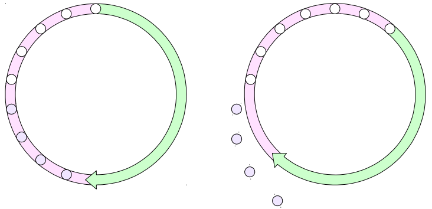

# Сопровождение

## Процедура очистки

* Варианты запуска очистки
* Обновление статистики
* Обновление карт видимости и свободного пространства
* Переполнение счетчика транзакций и заморозка

Очистка (vacuum) может вызываться разными способами и, помимо
собственно очистки страниц от старых версий строк, выполняет и ряд
других важных задач.

## Очистка

#### VACUUM

* `VACUUM` таблица очистка таблицы
* `VACUUM` очистка всей БД
* `$ vacuumdb` обертка для использования в ОС


* выполняется параллельно с другими транзакциями&
* частый запуск нагружает подсистему ввода-вывода
* редкий запуск приводит к росту размера файлов

Необходимость очистки вызвана тем, что при изменении и удалении
строк в страницах сохраняются их старые версии, как того требует
механизм многоверсионности (модуль «Архитектура»). Неактуальные
версии приходится периодически удалять.

Очистка работает параллельно с другими транзакциями, обрабатывая
файлы постранично. Из-за этого она не минимизирует место,
занимаемое объектами, и не уменьшает размер файлов (за
исключением случая, когда несколько страниц в конце файла
освобождаются полностью). Вместо этого в файлах образуется
свободное пространство, которое впоследствии может использоваться
для вставки новых версий строк.

Очистку можно запускать вручную командой `VACUUM`, но как часто это
делать? Слишком частый запуск создаст ненужную нагрузку на систему.
Если же запускать очистку редко, при большом объеме изменений
файлы могут успеть существенно вырасти в размерах.

https://postgrespro.ru/docs/postgresql/10/sql-vacuum

## Очистка

#### VACUUM FULL
* `VACUUM FULL` таблица очистка таблицы
* `VACUUM FULL` очистка всей БД
* `$ vacuumdb --full` обертка для использования в ОС


* полностью перестраивает содержимое таблиц и индексов,
* уменьшая размер файлов и минимизируя место
* требует эксклюзивной блокировки на таблицу
* похожим образом работает `TRUNCATE`

При хорошо настроенном процессе файлы данных вырастают на
некоторую постоянную величину за счет обновлений между запусками
очистки. Если файлы выросли значительно (например, за счет
массовых внеплановых изменений, с которыми автоочистка не
справилась вовремя), это может привести не только к перерасходу
места на дисках, но и к замедлению работы системы. Тогда для
освобождения места потребуется полная очистка.

Команда `VACUUM FULL` полностью перезаписывает содержимое
таблиц и индексов, минимизируя занимаемое место. Однако этот
процесс требует эксклюзивной блокировки таблицы и поэтому не может
выполняться параллельно с другими транзакциями.

Кстати, похожим образом работает и команда SQL `TRUNCATE`. Она
сразу же освобождает все строки, не требуя после себя очистки, в
отличие от `DELETE`. Но, хотя `TRUNCATE` и является транзакционной
командой, она устанавливает эксклюзивную блокировку на таблицу.
Таким образом, `TRUNCATE` начнет выполняться только после
завершения всех транзакций, использующих таблицу (хотя бы и для
чтения), и, пока транзакция с truncate не завершится, любой доступ к
таблице будет блокирован (хотя бы и на чтение).

Если продолжительная эксклюзивная блокировка нежелательна,
можно рассмотреть стороннее расширение `pg_repack`
https://github.com/reorg/pg_repack, позволяющее выполнить
перестроение таблицы и ее индексов «на лету».

## Обновление статистики

* Фоновый процесс autovacuum
  * автоматически обновляет статистику при значительных изменениях
  * используется случайная выборка данных (размер настраивается)
* ANALYZE
  * `ANALYZE [таблица]`
  * `$ vacuumdb --analyze-only`
  * обновление статистики (анализ) вручную
* VACUUM
  * `VACUUM ANALYZE [таблица]`
  * `$ vacuumdb --analyze`
  * помимо очистки также обновляет статистику

Актуальная статистика жизненно необходима для правильной работы
оптимизатора.

Фоновый процесс autovacuum, помимо очистки, выполняет сбор и
обновление статистики по изменяющимся таблицам.

Если этого недостаточно, статистику можно обновить в ручном режиме
с помощью отдельной команды `ANALYZE` или вместе с очисткой
`VACUUM ANALYZE`.

При сборе статистики читается случайная выборка данных
определенного размера. Это позволяет быстро собирать статистику
даже по очень большим таблицам. Результат получается не точный,
но в большинстве случаев в этом нет ничего страшного. При
необходимости размер выборки можно увеличить.

https://postgrespro.ru/docs/postgresql/10/sql-analyze

## Обновление карт

* Карта видимости
  * битовая карта страниц с видимыми всем версиями строк (отмечает «давно не менявшиеся» страницы)
  * признак видимости сбрасывается при любом изменении, а устанавливается автоматически в процессе очистки
  * используется для оптимизации доступа
* Карта свободного пространства
  * структура, отмечающая свободное место в страницах
  * обновляется в том числе при очистке
  * используется для поиска страниц при вставке новых строк

Карты видимости и свободного пространства обсуждались в модуле
«Организация данных».

Напомним, что карта видимости отмечает страницы, которые содержат
только такие версии строк, которые видны всем транзакциям. Иными
словами, в странице не должно быть двух версий одной и той же
строки. Фактически, это страницы, которые не изменялись достаточно
давно.

Карта используется для оптимизации доступа. В частности, процессу
очистки нет необходимости просматривать отмеченные страницы, так
как они давно не менялись и в них нечего очищать.

При всяком изменении данных в странице признак видимости этой
страницы сбрасывается. Установка признака происходит автоматически
при любом из вариантов очистки.
https://postgrespro.ru/docs/postgresql/10/storage-vm

Карта свободного пространства отмечает страницы, не полностью
заполненные данными.
Карта используется для поиска страницы при вставке (и обновлении,
так как обновление трактуется как удаление и вставка) новых строк.
Карта свободного пространства обновляется, в том числе, процессом
очистки, когда он удаляет из страниц старые версии строк.
https://postgrespro.ru/docs/postgresql/10/storage-fsm

## Переполнение и заморозка

* Номер транзакции 32-битный
  * пространство номеров закольцовано
  * старые версии строк «замораживаются» автоочисткой



Как говорилось в модуле «Архитектура», PostgreSQL упорядочивает
события с помощью номеров транзакций. Под счетчик отведено 32 бита
и в сильно нагруженной системе он может переполниться. Но если
счетчик сбросится в ноль, то упорядоченность транзакций нарушится.

Чтобы не допустить такой ситуации, пространство номеров
закольцовано: для любой транзакции считается, что половина номеров
находится в прошлом, а другая половина — в будущем.

Однако дойдя по кольцу до номера очень старой транзакции, мы
увидели бы ее изменения в будущем. Поэтому версии строк, которые
видны уже в каждом снимке, периодически помечаются как
«замороженные». Механизм многоверсионности считает, что такие
версии строк появились в далеком прошлом и больше не смотрит на
номера создавших их транзакций.

Заморозку автоматически выполняет процесс автоочистки. Раньше
приходилось периодически полностью сканировать таблицы в поисках
еще не замороженных версий, но в PostgreSQL 9.6 этот процесс
оптимизирован: в карту видимости добавлена карта заморозки —
дополнительный бит, отмечающий те страницы, которые содержат
только замороженные версии строк.

Если же серверу встречается не замороженная транзакция в половине
номеров, относящихся к будущему, он принудительно останавливается;
транзакция откатывается. После этого администратор должен вручную
стартовать сервер и выполнить очистку.

https://postgrespro.ru/docs/postgresql/10/routine-vacuuming.html#vacuum-for-wraparound

## Индексы

* Мониторинг индексов
* Перестроение индексов

Следует отслеживать состояние индексов и — когда уместно — удалять ненужные или перестраивать существующие.

## Мониторинг индексов

* «Лишние» индексы 
  * не используемые (мониторинг `pg_stat_all_indexes.idx_scan`)
  * дублирующиеся или пересекающиеся (запросы к `pg_index`)
  * проблемы: накладные расходы на изменения, место на диске
  * решение: удаление лишних индексов (аккуратное)
* Разрастание индексов
  * мониторинг `pg_relation_size()`
  * проблемы: место на диске, уменьшение эффективности
  * решение: перестроение индексов

**Индексы** — достаточно сложные структуры по сравнению с таблицами.
При активном удалении и вставке строк, индексы могут необоснованно
увеличиваться в объеме. Например, если речь идет о B-деревьях,
индексная страница при переполнении делится на две, которые уже
никогда не объединяются, даже если все строки, на которые ссылались
записи из этих страниц, удалены. Освободившееся место, безусловно,
доступно для вставки новых записей, но при неудачном стечении
обстоятельств индекс, тем не менее, может сильно вырасти в размере.

Администратор должен присматривать за индексами и при
необходимости перестраивать их.

https://wiki.postgresql.org/wiki/Show_database_bloat

https://postgrespro.ru/docs/postgresql/10/pgstattuple

## Перестроение индексов

* REINDEX
  * `REINDEX INDEX` индекс перестроить индекс
  * `REINDEX TABLE` таблица перестроить все индексы таблицы
  * `REINDEX SCHEMA` схема перестроить все индексы схемы
  * `REINDEX DATABASE` база перестроить все индексы текущей БД
  * `REINDEX SYSTEM` база перестроить только системные индексы
  * перестраивает индекс, минимизируя занимаемое место
  * устанавливает эксклюзивную блокировку
* VACUUM FULL
  * вместе с таблицей перестраивает и индексы
  * также устанавливает эксклюзивную блокировку

Перестраивание может выполняться командой `REINDEX`. Она заново
пересоздает индекс и заменяет им старый. Она, однако, устанавливает
на таблицу эксклюзивную блокировку, поэтому любая параллельная
работа с таблицей будет приостановлена.

Индексы также перестраиваются при выполнении `VACUUM FULL`,
и тоже с эксклюзивной блокировкой. По сути, обе команды работают
одинаково, просто `REINDEX` обрабатывает только индексы, оставляя
таблицу без изменений.

https://postgrespro.ru/docs/postgresql/10/sql-reindex

## Перестроение индексов

* Пересоздание без эксклюзивной блокировки
  * `CREATE INDEX новый ON ... CONCURRENTLY;`
  * `DROP INDEX старый CONCURRENTLY;`
  * допускается создание нескольких индексов по одним и тем же полям
  * не все типы индексов поддерживают неблокирующее создание
  * неблокирующее создание не транзакционно
  * неблокирующее создание может завершиться неудачно
* Индекс с ограничением целостности
  * `CREATE UNIQUE INDEX новый ON ... CONCURRENTLY;`
  * `ALTER TABLE ...`
  * `DROP CONSTRAINT старое, ADD CONSTRAINT новое [UNIQUE|PRIMARY KEY] USING INDEX новый;`

Альтернативный способ — перестроение индекса вручную в несколько
шагов.

Сначала создается новый индекс в неблокирующем режиме (ключевое
слово `CONCURRENTLY`), который позволяет вести параллельную
работу с таблицей. Однако неблокирующее создание может
завершиться неудачно (из-за взаимоблокировок) — в таком случае
индекс потребуется удалить и попробовать создать еще раз. Кроме
того, такая операция не может выполняться внутри транзакции.

Затем старый индекс удаляется. Это также можно сделать
в неблокирующем режиме, чтобы не мешать запросам, использующим
индекс.

Если же индекс участвует в ограничении целостности, старое
ограничение удаляется (при этом удаляется и старый индекс) и
создается новое.

https://postgrespro.ru/docs/postgresql/10/sql-createindex

https://postgrespro.ru/docs/postgresql/10/sql-altertable

## Практика

### TITTLE
```shell

```

### TITTLE
```shell

```

### TITTLE
```shell

```

### TITTLE
```shell

```

### TITTLE
```shell

```

### TITTLE
```shell

```

### TITTLE
```shell

```

### TITTLE
```shell

```

## Итоги
* Процесс очистки решает много задач помимо очистки:
  * сбор статистики для планировщика
  * обновление карт видимости и свободного пространства
  * заморозка старых версий строк
* Автоочистка должна работать, но требует настройки
* Индексы требуют мониторинга и (иногда) пересоздания
* Другие задачи сопровождения рассматриваются отдельно