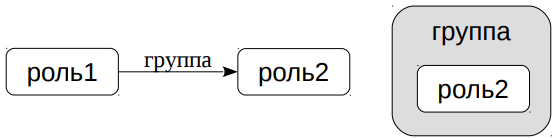
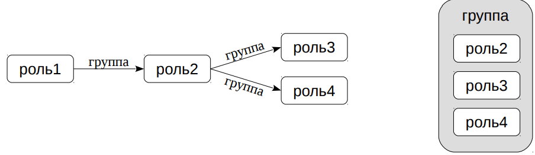

# Роли и атрибуты
    
## Роли

* Роль
  * пользователь СУБД
  * может включать в себя другие роли — быть «групповой ролью»
  * никак не связана с пользователем ОС (хотя некоторые программы
  * берут имя пользователя ОС как имя роли по умолчанию)
  * определяется на уровне кластера
* Псевдороль public
  * неявно включает в себя все остальные роли
  
Любая роль может рассматриваться и как пользователь СУБД, и в то же
время может включать в себя другие роли.

Роли никак не связаны с именами пользователей ОС, хотя некоторые
программы это предполагают, выбирая значения по умолчанию.

Роли являются общими объектами кластера. Например, одна роль
может подключаться к разным базам данных и быть владельцем
объектов в разных БД.

При создании кластера определяется одна начальная роль, имеющая
суперпользовательский доступ. В дальнейшем роли можно создавать,
изменять и удалять.

Также существует псевдороль public, в которую всегда неявно включены
все остальные роли.

https://postgrespro.ru/docs/postgresql/10/database-roles

## Атрибуты

* Атрибуты определяют свойства роли
  * `CREATE ROLE роль [WITH] атрибут [атрибут ...]`
  * `LOGIN` возможность подключения
  * `SUPERUSER` суперпользователь
  * `CREATEDB` возможность создавать базы данных
  * `CREATEROLE` возможность создавать роли
  * `REPLICATION` использование протокола репликации
  * и другие

Роль обладает некоторыми атрибутами, определяющими ее общие
особенности и права (не связанные с правами доступа к объектам).

Обычно атрибуты имеют два варианта, например, `CREATEDB` (дает
право на создание БД) и `NOCREATEDB` (не дает такого права). Как
правило, по умолчанию выбирается ограничивающий вариант.

Если у роли нет атрибута `LOGIN`, она не сможет подключиться к
серверу. Такие роли тоже имеют смысл в качестве групповых.

В таблице перечислены лишь некоторые из атрибутов. Атрибуты
`INHERIT` и `BYPASSRLS` рассматривается дальше в этом модуле.

https://postgrespro.ru/docs/postgresql/10/role-attributes

https://postgrespro.ru/docs/postgresql/10/sql-createrole


## Участие в групповой роли    

* Включение роли в группу
  * роль1: `GRANT группа TO роль2;`



* Исключение роли из группы
  * роль1: `REVOKE группа FROM роль2;`

* Право управления участием в групповой роли имеют:
  * любая роль — в самой себе
  * роль с атрибутом `SUPERUSER` — в любой роли
  * роль с атрибутом `CREATEROLE` — в любой, кроме суперпользовательской

Роль может быть включена в другую роль подобно тому, как
пользователь Unix может быть включен в группу.

Однако PostgreSQL не делает различий между ролями-пользователями
и ролями-группами. Поэтому любая роль может быть включена в любую
другую. При этом возможно появление цепочек включений (но циклы не
допускаются).

Смысл такого включения состоит в том, что для роли становятся
доступны атрибуты (и привилегии, о которых пойдет речь дальше),
которыми обладает групповая роль. Чтобы воспользоваться правами,
которые дают атрибуты групповой роли, необходимо переключиться в
нее командой `SET ROLE`.

Правом на включение и исключение других ролей в данную роль
обладают:
- сама эта роль,
- роль с атрибутом `SUPERUSER`,
- роль с атрибутом `CREATEROLE` (если это не суперпользовательская
  роль).


  https://postgrespro.ru/docs/postgresql/10/role-membership
  
## Передача права управления

* Включение в группу с передачей права управления
  * роль1: `GRANT группа TO роль2 WITH ADMIN OPTION;`
  * теперь роль2 управляет группой, включая передачу права управления:
  * роль2: `GRANT группа TO роль3 WITH ADMIN OPTION;`
  * роль2: `GRANT группа TO роль4 WITH ADMIN OPTION;`



* Отзыв права передачи управления
  * роль1: `REVOKE ADMIN OPTION FOR группа FROM роль2;`

При включении роли в группу можно передать ей право управления
(право на дальнейшее включение других ролей в эту группу и на
исключение их из группы). Такие роли образуют иерархию включений.

Это право можно отобрать с помощью `REVOKE ADMIN OPTION FOR`,
не исключая роль из группы.

https://postgrespro.ru/docs/postgresql/10/sql-revoke

## Владельцы

* Владелец объекта
  * роль, создавшая объект (а также роли, включенные в нее)
  * может быть изменен командой `ALTER ... OWNER TO роль`

Когда роль создает в базе данных какие-либо объекты, она становится
их владельцем. На самом деле владельцами считаются также и роли,
включенные в создавшую объект роль.

При необходимости владельца объекта можно сменить. Для этого
используется команда `ALTER` для соответствующего объекта с фразой
`OWNER TO`.

Понятие владельца будет важно для следующей темы модуля —
привилегий.

## Практика

### Создание ролей
```shell
# Создадим роль

postgres => CREATE ROLE alice LOGIN CREATEROLE;
CREATE ROLE

# В этом модуле приглашение будет показывать имя роли, от которой выполняется 
# команда.

# Алиса имеет возможность подключения (атрибут LOGIN) и создания других ролей
# (CREATEROLE).

# Проверим это:

postgres => \c - alice
You are now connected to database "postgres" as user "alice".

alice => CREATE ROLE  bob LOGIN;
CREATE ROLE

# Действительно, получилось и подключиться, и создать другого пользователя, Боба.

# А вот Боб не сможет создать другую роль:

postgres$ psql -U bob -d postgres

bob => CREATE ROLE charlie LOGIN;
ERROR:  permission denied to create role

# Посмотреть роли, имеющиеся в класетере, можно так:

alice => \du
                                   List of roles
 Role name |                         Attributes                         | Member of 
-----------+------------------------------------------------------------+-----------
 alice     | Create role                                                | {}
 bob       |                                                            | {}
 postgres  | Superuser, Create role, Create DB, Replication, Bypass RLS | {}

# Или в системном каталоге:

alice => SELECT usename FROM pg_user;
 usename  
----------
 postgres
 alice
 bob
(3 rows)

# Существующие роли можно изменять. Например, Алиса может отобрать у Боба
# право входа:

alice => ALTER ROLE bob NOLOGIN;
ALTER ROLE

# А у себя у самой Алиса отберет CREATE ROLE:

alice => ALTER ROLE alice NOCREATEROLE;
ALTER ROLE

# Такие пары, как LOGIN-NOLOGIN или CREATEROLE-NOCREATEROLE, есть и у других
# атрибутов.

# Теперь Боб не сможет подключиться:

alice => \c - bob
connection to server on socket "/tmp/.s.PGSQL.5432" failed: FATAL:  role "bob" is not permitted to log in
Previous connection kept

```

### Груповые роли
```shell
# А Алиса теперь не может ни создавать новые роли, ни изменять атрибуты существующих:

alice => ALTER ROLE bob LOGIN;
ERROR:  permission denied

# Чтобы снова наделить Алису супервозможностями, включим её в
# в суперпользовательскую роль postgres:

alice => \c - postgres
You are now connected to database "postgres" as user "postgres".

=> GRANT postgres TO alice;
GRANT ROLE

=> \du
                                    List of roles
 Role name |                         Attributes                         | Member of  
-----------+------------------------------------------------------------+------------
 alice     |                                                            | {postgres}
 bob       | Cannot login                                               | {}
 postgres  | Superuser, Create role, Create DB, Replication, Bypass RLS | {}

# А чтобы Алиса не злоупотребляла полномочиями, сделаем так, чтобы все ее
# команды попадали в журнал сообщений:

=> ALTER ROLE alice SET log_min_duration_statement=0;
ALTER ROLE

# Это еще один вариант установки конфигурационных параметров - он срабатывает
# при подключени пользователя к серверу.

# Можно ограничить действие и конкретной базой данных:

=> ALTER ROLE alice RESET log_min_duration_statement;
ALTER ROLE

=> ALTER ROLE alice IN DATABASE postgres SET log_min_duration_statement=0;
ALTER ROLE

# Алиса не получает возможности групповой роли автоматически. Она может ими 
# воспользоваться, только если переключится на эту роль: 

=> \c - alice 
You are now connected to database "postgres" as user "alice".

alice => SET ROLE postgres;
SET 

alice => ALTER ROLE bob LOGIN;
ALTER ROLE 

# Это напоминает команду su в OC Unix.

# Чтобы понять, кем является пользователь на самом деле, и на какую роль он 
# переключился, есть функция:

alice => SELECT session_user, current_user;
 session_user | current_user 
--------------+--------------
 alice        | postgres
(1 row)

# Вернемся к прежней роли:

alice => RESET ROLE;
RESET

alice => SELECT session_user, current_user;
 session_user | current_user 
--------------+--------------
 alice        | alice
(1 row)
```

### Владение объектами
```shell
# Когда Алиса создаем какой-либо объект в БД, она становится его владельцем.

alice => CREATE TABLE test(id integer);

# Как в этом убедиться? Владелец указан в столбце owner:

alice => \dt test
       List of relations
 Schema | Name | Type  | Owner 
--------+------+-------+-------
 public | test | table | alice
(1 row) 
```

### Удаление ролей
```shell
# Удалить роль можно, если нет объектов, которыми она владеет.

alice => \c - postgres
You are now connected to database "postgres" as user "postgres".

=> DROP ROLE alice;
ERROR:  role "alice" cannot be dropped because some objects depend on it
DETAIL:  owner of table test

# Чтобы удалить Алису, можно передать ее объекты другой роли:

=> REASSIGN OWNED BY alice TO bob;
REASSIGN OWNED

=> \dt test
       List of relations
 Schema | Name | Type  | Owner 
--------+------+-------+-------
 public | test | table | bob
(1 row)

=> DROP ROLE alice
DROP ROLE
```

## Итоги

- Роли объединяют концепции пользователей и групп
- Атрибуты определяют свойства ролей
- Роли можно включать друг в друга