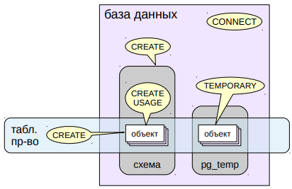
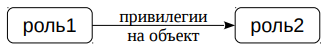
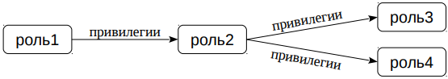

# Привилегии

## Виды привилегий

* Таблицы
  *  можно задавать на уровне столбцов
     * `SELECT` чтение данных
     * `INSERT` вставка строк
     * `UPDATE` изменение строк
     * `REFERENCES` внешний ключ
  * `DELETE` удаление строк
  * `TRUNCATE` очистка таблицы
  * `TRIGGER` создание триггеров
* Представления — `SELECT` и `TRIGGER`
* Последовательности
  * `SELECT` currval
  * `UPDATE` nextval setval
  * `USAGE` currval nextval

Привилегии (права) определяют права доступа ролей к объектам.

https://postgrespro.ru/docs/postgresql/10/ddl-priv

Список возможных привилегий отличается для объектов различных
типов. Привилегии для основных объектов приведены на этом и
следующем слайдах.

Больше всего привилегий определено для таблиц. Некоторые из них
можно определить не только для всей таблицы, но и для отдельных
столбцов.

## Виды привилегий

Табличные пространства, базы данных, схемы


* Функции
  * `EXECUTE`
    * выполнение с правами:
    * `SECURITY INVOKER` — вызвавшего (по умолчанию),
    * `SECURITY DEFINER` — создавшего

Для табличных пространств есть привилегия `CREATE`, разрешающая
создание объектов в этом пространстве.

Для баз данных привилегия `CREATE` разрешает создавать схемы в этой
БД, а для схемы привилегия `CREATE` разрешает создавать объекты в
этой схеме.

Поскольку точное имя схемы для временных объектов заранее
неизвестно, привилегия на создание временных таблиц вынесено на
уровень БД (`TEMPORARY`).

Привилегия `USAGE` схемы разрешает обращаться к объектам в этой
схеме.

Привилегия `CONNECT` базы данных разрешает подключение к этой БД.

Для функций есть единственная привилегия `EXECUTE`, разрешающая
выполнение этой функции. Тонкий момент связан с тем, от имени какого
пользователя будет выполняться функция. Если функция создана как
`SECURITY INVOKER `(по умолчанию), она выполняется с правами
вызывающего пользователя. Если же указать фразу `SECURITY`
`DEFINER`, функция работает с правами создавшего ее пользователя
(точнее, с правами ее текущего владельца).

## Категории ролей

* Суперпользователи
  * полный доступ ко всем объектам — проверки не выполняются
* Владельцы
  * доступ в рамках выданных привилегий (изначально получает полный набор)
  * а также действия, не регламентируемые привилегиями,
  * например: удаление, выдача и отзыв привилегий и т. п.
* Остальные роли
  * доступ исключительно в рамках выданных привилегий

В целом можно сказать, что доступ роли к объекту определяется
привилегиями. Но можно выделить три категории ролей.
1. Проще всего с ролями с атрибутом суперпользователя. Такие роли
   могут делать все, что угодно — для них проверки разграничения
   доступа не выполняются.
2. Владелец объекта сразу получает полный набор привилегий для
   этого объекта. В принципе, эти привилегии можно отозвать, но
   владелец объекта обладает также неотъемлемым правом совершать
   действия, не регламентируемые привилегиями. В частности, он может
   выдавать и отзывать привилегии (в том числе и себе самому), удалять
   объект и т. п.
3. Все остальные роли имеют доступ к объекту только в рамках
   выданных им привилегий.

## Управление привилегиями

* Выдача привилегии
  * роль1: `GRANT привилегии ON объект TO роль2`;
  
  * 
  * одна привилегия может быть независимо выдана разными ролями
* Отзыв привилегии
  * роль1: `REVOKE привилегии ON объект FROM роль2;`

Право выдачи и отзыва привилегий на объект имеет владелец этого
объекта (и суперпользователь).

Синтаксис команд `GRANT` и `REVOKE` достаточно сложен и позволяет
указывать как отдельные, так и все возможные привилегии; как
отдельные объекты, так и группы объектов, входящие в определенные
схемы и т. п.

https://postgrespro.ru/docs/postgresql/10/sql-grant

https://postgrespro.ru/docs/postgresql/10/sql-revoke

## Передача права

* Выдача привилегии с правом передачи
  * роль1: `GRANT привилегии ON объект TO роль2 WITH GRANT OPTION;`
  * 
* Отзыв привилегии
  * роль1: `REVOKE привилегии ON объект FROM роль2 CASCADE;`
* Отзыв права передачи
  * роль1: `REVOKE GRANT OPTION FOR привилегии ON объект FROM роль2 CASCADE;`

При выдаче роли полномочия можно передать ей право дальнейшей
передачи (и отзыва) этого полномочия. Это выполняется командой
`GRANT … WITH GRANT OPTION` (похожая конструкция `WITH ADMIN
OPTION` для атрибутов рассматривалась в предыдущей теме «Роли»).

Если роль воспользуется этим правом, образуется иерархия ролей.
Отозвать привилегию можно с помощью команды `REVOKE`. Роль может
отозвать привилегию только у той роли, которой она его выдала.

Например, роль1 не может отозвать привилегию непосредственно у
роль3 или роль4.

Однако при отзыве привилегии у роль2 привилегия будет
автоматически отозвана у всех ролей в иерархии. Для этого надо
указать ключевое слово `CASCADE` (если иерархия непуста, то без
`CASCADE` будет ошибка).

Право передачи можно отозвать, не отзывая у роли саму привилегию.
Это выполняется с помощью команды `REVOKE GRANT OPTION FOR`.
Слово `CASCADE` имеет здесь такое же значение, как и при отзыве
привилегии.

## Групповые привилегии

* Роль получает привилегии своих групповых ролей
  * поведение зависит от атрибута роли:
    * `INHERIT` (по умолчанию) `NOINHERIT`
    * автоматически наследует требуется явное переключение привилегии группы с помощью `SET ROLE`
* Преднастроенные роли
  * `pg_signal_backend` — сигналы обслуживающим процессам
  * `pg_read_all_settings` — чтение конфигурационных параметров
  * `pg_read_all_stats` — доступ к статистике
  * `pg_stat_scan_tables` — статистика, вызывающая блокировки

Роль может получать привилегии для доступа к объекту не только
непосредственно, но и от групповых ролей, в которые она входит.

Роль с атрибутом `INHERIT` (по умолчанию) автоматически обладает
привилегиями всех групп, в которые она входит. Это касается и
псевдороли `public`, в которую неявно входят все роли.

Если же роль создана как `NOINHERIT`, то она может воспользоваться
привилегиями группы, только выполнив команду `SET ROLE` и таким
образом переключившись на эту групповую роль. Все действия,
совершаемые ролью, будут совершаться от имени групповой роли
(например, групповая роль будет владельцем созданных объектов).

https://postgrespro.ru/docs/postgresql/10/role-membership

В PostgreSQL уже есть ряд преднастроенных групп, обладающих рядом
специальных привилегий для выполнения задач, которые обычно
может совершать только суперпользователь. Большая часть из них
появилась в версии PostgreSQL 10.

https://postgrespro.ru/docs/postgresql/10/default-roles

Аналогично можно создавать и собственные групповые роли, например,
для управления резервным копированием и т. п.

## Привилегии public

* По умолчанию роль public получает ряд привилегий

| для баз данных | для схемы `public` | для схем pg_catalog и information_schema | для функций |
| ----- | ----- | ----- | ----- |  
| `CONNECT` (подключение)  | `CREATE` (создание объектов) | `USAGE` (доступ к объектам) | `EXECUTE` (выполнение)|
| `TEMPORARY` (создание временных таблиц)  | `USAGE` (доступ к объектам)  |
* Удобно, но не безопасно

По умолчанию псевдороль `public` получает ряд привилегий (то есть,
фактически, их получают все роли):
- подключение и создание временных таблиц для всех баз данных
- использование схемы `public` и создание в ней объектов
- использование схем `pg_catalog` и `information_schema`
- выполнение всех функций

Такое поведение может оказаться нежелательным. В этом случае надо явно отзывать у `public` привилегии.
  
https://postgrespro.ru/docs/postgresql/10/sql-grant

## Привилегии по умолчанию

* Дополнительные привилегии по умолчанию
  * `ALTER DEFAULT PRIVILEGES
   [ IN SCHEMA схема ]
   GRANT привилегии ON класс_объектов TO роль;`
  * `ALTER DEFAULT PRIVILEGES
    [ IN SCHEMA схема ]
    REVOKE привилегии ON класс_объектов FROM роль;`

Можно настроить дополнительные привилегии, выставляемые по
умолчанию, с помощью команды `ALTER DEFAULT PRIVILEGES`.

Привилегии, которые получает пcевдороль `public`, здесь не отражаются
и не могут быть отключены. Поэтому, даже если отозвать у public все
привилегии на все существующие объекты, эта роль будет получать
привилегии на все новые объекты, создающиеся в системе.

Но с помощью привилегий по умолчанию можно автоматически
отзывать у public привилегию выполнения функций, как только она
появляется.

https://postgrespro.ru/docs/postgresql/10/sql-alterdefaultprivileges

## Практика

### Создание объектов 
```shell
# В нашем примере Алиса будет владельцем нескольких объектов в своей схеме.

=> CREATE ROLE alice LOGIN;
CREATE ROLE

=> CREATE SCHEMA alice;
CREATE SCHEMA

=> GRANT CREATE, USAGE ON SCHEMA alice to alice;
GRANT

=> \c - alice
You are now connected to database "postgres" as user "alice".

# Алиса создает пару таблиц

alice => CREATE TABLE t1(n integer);
CREATE TABLE

alice => CREATE TABLE t2(n integer, m integer);
CREATE TABLE

# Вторая роль Боб, будет пытаться обращаться к объектам Алисы.

alice => \c - postgres
You are now connected to database "postgres" as user "postgres".

=> CREATE ROLE bob LOGIN;
CREATE ROLE;
```

### Привилегии 
```shell
# Боб попробует обратиться к таблице t1.

user$ psql -U bob -d postgres

bob => SELECT * FROM alice.t1;
ERROR:  permission denied for schema alice
LINE 1: SELECT * FROM alice.t1;

# В чем причина ошибки?

# У Боба нет доступа к схеме, так как он не суперпользователь, не владелец
# схемы, и не имеет нужных привилегий.

=> \dn+ alice
                    List of schemas
 Name  |  Owner   |  Access privileges   | Description 
-------+----------+----------------------+-------------
 alice | postgres | postgres=UC/postgres+| 
       |          | alice=UC/postgres    | 
(1 row)

# В каждой строке access privileges отображается роль, ее привилегии и кем 
# они были выданы:

# роль=привилегии/кем_предоставлены

# Название привилегий обозначаются одной буквой. Привилегии для схем:
# U = usage
# C = create

# Алисе надо выдать Бобу доступ к своей схеме.

=> \c - alice
You are now connected to database "postgres" as user "alice".

alice => GRANT CREATE, USAGE ON SCHEMA alice TO bob;
WARNING:  no privileges were granted for "alice"
GRANT

# Почему привилегия не выдалась?

# Потому что Алиса не является ее владельцем и у нее нет права перевыдачи.

alice => \dn+ alice
                    List of schemas
 Name  |  Owner   |  Access privileges   | Description 
-------+----------+----------------------+-------------
 alice | postgres | postgres=UC/postgres+| 
       |          | alice=UC/postgres    | 
(1 row)

# Сделаем Алису владельцем схемы:

alice => \c - postgres
You are now connected to database "postgres" as user "postgres".

=> ALTER SCHEMA alice OWNER TO alice;
ALTER SCHEMA

=> \dn+ alice
                 List of schemas
 Name  | Owner | Access privileges | Description 
-------+-------+-------------------+-------------
 alice | alice | alice=UC/alice    | 
(1 row)

# Теперь Алиса может выдать доступ Бобу:

=> \c - alice
You are now connected to database "postgres" as user "alice".

alice => GRANT CREATE, USAGE ON SCHEMA alice TO bob;
```